# UniQuest - Class Diagram

This diagram shows the complete data model and service architecture of the UniQuest system.

```mermaid
classDiagram
    %% User Management
    class User {
        +int id
        +string email
        +string username
        +string first_name
        +string last_name
        +string password
        +boolean is_verified
        +datetime created_at
        +datetime updated_at
        +__str__() string
    }

    %% Student Profile
    class StudentProfile {
        +int id
        +int user_id
        +string academic_level
        +decimal gpa
        +json academic_background
        +json work_experience
        +json test_scores
        +text interests
        +json preferred_programs
        +text goals
        +json preferred_regions
        +json preferred_countries
        +string country_preference
        +json campus_preference
        +string budget_currency
        +decimal budget_min
        +decimal budget_max
        +datetime created_at
        +datetime updated_at
        +__str__() string
        +interests_list() list
        +get_test_score(test_name) float
        +set_test_score(test_name, score, test_date) void
    }

    %% Preferences
    class Preference {
        +int id
        +int user_id
        +json weights
        +datetime created_at
        +datetime updated_at
        +__str__() string
        +get_default_weights() dict
        +get_weight(factor) float
        +set_weight(factor, weight) void
        +normalize_weights() void
        +save() void
    }

    %% Recommendations
    class Recommendation {
        +int id
        +int user_id
        +string university_ref
        +string program
        +float score
        +text rationale
        +json filters
        +json weights
        +datetime generated_at
        +__str__() string
        +score_percentage() int
        +get_filter_value(filter_name) any
        +get_weight_value(weight_name) float
    }

    %% Feedback
    class Feedback {
        +int id
        +int user_id
        +int recommendation_id
        +int rating
        +text notes
        +datetime created_at
        +__str__() string
        +is_positive() boolean
        +is_negative() boolean
    }

    %% Dataset Management
    class IngestionRun {
        +int id
        +string source
        +string version
        +string status
        +datetime started_at
        +datetime finished_at
        +json stats
        +text error
        +__str__() string
        +duration_seconds() float
        +is_completed() boolean
        +get_stat(stat_name, default) any
        +set_stat(stat_name, value) void
    }

    %% Service Layer
    class DatasetService {
        -Path base_path
        -string current_version
        -DuckDB _connection
        +connection() DuckDB
        +get_dataset_path(filename) Path
        +search_universities(filters, limit, offset, ordering) list
        +get_university(university_id) dict
        +recommend(filters, weights, limit) list
        +get_matching_universities(filters, limit) list
        +validate_dataset() dict
        +close() void
        -_get_current_version() string
        -_load_institutions_table() void
    }

    class RecommendationService {
        -DatasetService dataset_service
        -LLMService llm_service
        +generate_recommendations(user, filters, weights, top_n) list
        -_build_user_profile(user, filters) dict
        -_apply_user_weights(base_score, weights) float
    }

    class LLMService {
        +generate_rationale(university_data, user_profile, weights) string
        +create_rationale_prompt(university_data, user_profile, weights) string
        +score_university_match(university_data, user_profile) float
        +create_scoring_prompt(university_data, user_profile) string
        +analyze_student_profile(profile_data) dict
        +create_profile_analysis_prompt(profile_data) string
        -_fallback_rationale(university_data, weights) string
        -_fallback_score(university_data, user_profile) float
    }

    %% Relationships - Database Models
    User "1" -- "1" StudentProfile : has
    User "1" -- "1" Preference : has
    User "1" -- "0..*" Recommendation : creates
    User "1" -- "0..*" Feedback : provides
    Recommendation "1" -- "0..*" Feedback : receives

    %% Relationships - Services
    RecommendationService --> DatasetService : uses
    RecommendationService --> LLMService : uses
    RecommendationService --> Recommendation : creates
    RecommendationService --> Preference : reads
    RecommendationService --> User : queries
    DatasetService --> IngestionRun : tracks

    %% Notes
    note for User "Extends Django AbstractUser\nAuth0 integration via JWT"
    note for StudentProfile "Stores academic profile\nGPA, test scores, goals"
    note for Preference "Recommendation weights\nDefault: academics=0.3, interests=0.2"
    note for Recommendation "LLM-generated rationale\nScore range: 0.0-1.0"
    note for Feedback "Rating: 1-5 stars\nUnique per user+recommendation"
    note for IngestionRun "Tracks dataset versions\nStatus: PENDING|RUNNING|SUCCESS|FAILED"
    note for DatasetService "Queries Parquet files\nUses DuckDB for fast queries"
    note for LLMService "External API integration\nCaches responses"
```

## Model Descriptions

### Core Models (SQLite)

**User**
- Extended Django AbstractUser for authentication
- Integrates with Auth0 via JWT tokens
- Primary entity for all user-related data

**StudentProfile**
- One-to-one with User
- Stores academic information (academic level, GPA, academic background, work experience)
- Test scores stored as array (database: exam_name, score, test_date; API: examName, score, testDate)
- Contains interests, preferred programs, and career goals
- Location preferences (regions, countries, campus type)
- Budget information with currency support
- **Note:** Database uses snake_case, API JSON uses camelCase (automatic conversion via djangorestframework-camel-case)

**Preference**
- One-to-one with User
- Stores recommendation weights (0.0-1.0)
- Default weights: academics (30%), interests (20%), career (20%), location (10%), budget (10%), ranking (5%), research (5%)
- Weights can be normalized to sum to 1.0

**Recommendation**
- Many-to-one with User
- References universities by OpenAlex ID
- Contains LLM-generated rationale
- Stores snapshot of filters and weights used
- Score range: 0.0 to 1.0

**Feedback**
- Many-to-one with User and Recommendation
- Rating: 1-5 stars
- Optional text notes
- Unique constraint on (user, recommendation)

**IngestionRun**
- Tracks dataset ingestion history
- Stores statistics and errors
- Status tracking: PENDING → RUNNING → SUCCESS/FAILED

### Service Layer

**DatasetService**
- Manages file-backed university dataset
- Uses DuckDB for fast Parquet queries
- Provides search, filtering, and recommendation scoring
- Validates dataset integrity

**RecommendationService**
- Orchestrates recommendation generation
- Integrates DatasetService and LLMService
- Applies user preference weights
- Persists recommendations to database

**LLMService**
- Interfaces with external LLM API
- Generates personalized rationales
- Scores university-student matches
- Analyzes student profiles
- Implements caching for performance

## Key Design Patterns

1. **Service Layer Pattern** - Business logic separated from models
2. **Repository Pattern** - Django ORM abstracts database access
3. **Hybrid Storage** - SQLite for transactional data, Parquet for read-heavy dataset
4. **External Integration** - Auth0 for authentication, LLM API for intelligence
5. **Snapshot Pattern** - Recommendations store filters/weights used at generation time

## Relationships Summary

- User has 1 StudentProfile (one-to-one)
- User has 1 Preference (one-to-one)
- User has many Recommendations (one-to-many)
- User provides many Feedback entries (one-to-many)
- Recommendation receives many Feedback entries (one-to-many)
- RecommendationService uses DatasetService and LLMService
- DatasetService tracks IngestionRuns

