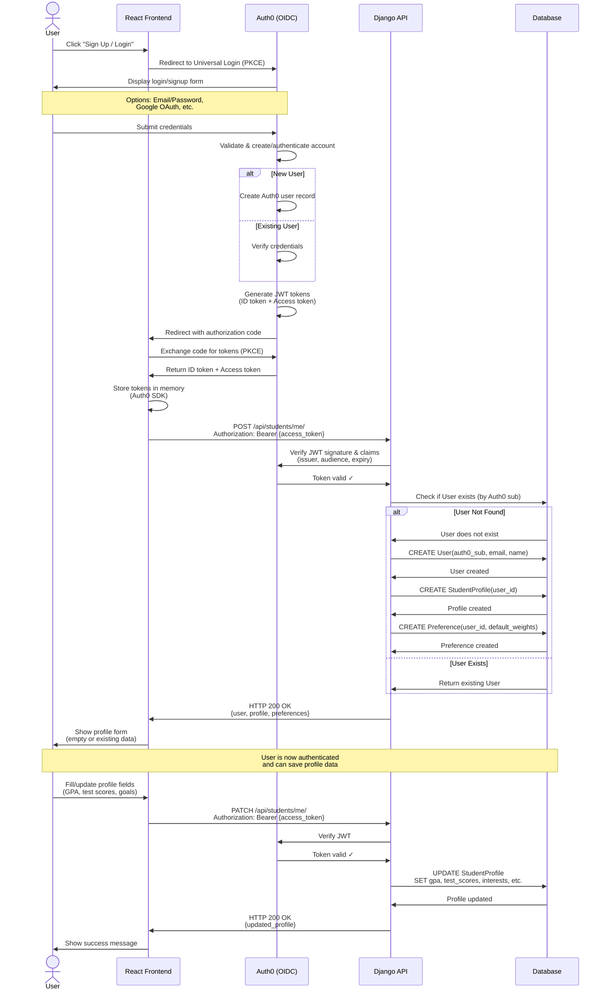

# UniQuest - Sequence Diagram: User Registration & Profile Creation

This diagram shows the complete flow of user registration and profile creation using Auth0.

## Flow Description

### Phase 1: Authentication (Auth0)
1. User clicks "Sign Up" or "Login"
2. Frontend redirects to Auth0 Universal Login using PKCE flow
3. User enters credentials or uses social login (Google)
4. Auth0 validates and creates/authenticates account
5. Auth0 generates JWT tokens (ID token for user info, Access token for API)
6. Frontend receives tokens via secure callback

### Phase 2: Backend User Creation
7. Frontend calls Django API with Access token in Authorization header
8. Django API verifies JWT with Auth0 (signature, issuer, audience, expiry)
9. API extracts Auth0 `sub` (subject) claim as unique user identifier
10. If user doesn't exist, API creates:
    - User record (linked to Auth0 sub)
    - Empty StudentProfile
    - Preference with default weights
11. API returns user data to frontend

### Phase 3: Profile Setup
12. User sees profile form (empty for new users, prefilled for returning users)
13. User fills in academic information (GPA, test scores, goals, preferences)
14. Frontend sends PATCH request to update profile
15. API verifies JWT again and updates StudentProfile in database
16. User receives confirmation

## Security Notes

- **No password storage**: All credentials managed by Auth0
- **JWT verification**: Every API call validates token with Auth0
- **PKCE flow**: Secure OAuth for Single Page Applications
- **Token storage**: Tokens kept in memory (not localStorage) via Auth0 SDK
- **Short-lived tokens**: Access tokens expire, refresh tokens used for renewal

## Key Endpoints

- `Auth0 /authorize` - Initiate OIDC login
- `Auth0 /oauth/token` - Exchange code for tokens
- `Auth0 /.well-known/jwks.json` - Public keys for JWT verification
- `POST /api/students/me/` - Create/get profile
- `PATCH /api/students/me/` - Update profile

## Error Scenarios

1. **Invalid JWT**: API returns 401 Unauthorized
2. **Expired token**: Frontend refreshes token silently with Auth0
3. **Auth0 down**: User sees "Authentication service unavailable"
4. **Database error**: API returns 500, user can retry

