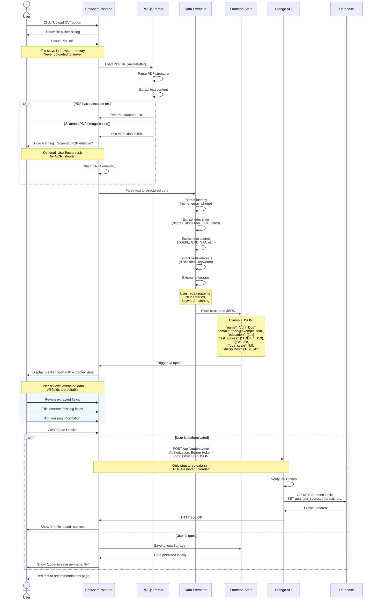

# UniQuest - Sequence Diagram: CV Upload & Profile Prefill

This diagram shows the client-side CV parsing flow (no file upload to backend).



## Flow Description

### Phase 1: File Selection & Parsing (Client-Side)
1. User selects PDF file from their device
2. File loaded into browser memory (ArrayBuffer)
3. PDF.js library parses PDF structure and extracts text
4. If PDF is scanned (image-based), optional OCR with Tesseract.js

### Phase 2: Data Extraction (Client-Side)
5. Custom extractor parses text using:
   - **Regex patterns** for structured data (GPA: 3.8/4.0, TOEFL: 110)
   - **Keyword matching** for sections (Education, Experience, Skills)
   - **NLP libraries** for entity recognition (names, dates, institutions)
6. Extracted data structured into JSON format
7. JSON stored in frontend state (React/Zustand)

### Phase 3: User Review & Edit
8. Prefilled form displayed to user
9. All fields are editable (user can correct extraction errors)
10. User adds any missing information
11. User confirms data is correct

### Phase 4: Profile Save
12. If authenticated: POST structured JSON to backend API
13. If guest: Save to localStorage for later
14. Backend never receives the PDF file (privacy-first design)

## Data Extraction Examples

### Education Extraction
```
Input Text: "Bachelor of Science in Computer Science, Stanford University, 2019-2023, GPA: 3.8/4.0"

Extracted JSON:
{
  "degree": "Bachelor of Science",
  "major": "Computer Science",
  "institution": "Stanford University",
  "start_year": 2019,
  "end_year": 2023,
  "gpa": 3.8,
  "gpa_scale": 4.0
}
```

### Test Scores Extraction
```
Input Text: "TOEFL iBT: 110/120, GRE Quantitative: 165, GRE Verbal: 158, GRE AWA: 4.0"

Extracted JSON:
{
  "TOEFL": 110,
  "GRE_Q": 165,
  "GRE_V": 158,
  "GRE_AWA": 4.0
}
```

### Skills/Interests Extraction
```
Input Text: "Interests: Machine Learning, Artificial Intelligence, Data Science, Python, TensorFlow"

Extracted JSON:
{
  "disciplines": ["Machine Learning", "Artificial Intelligence", "Data Science"],
  "technical_skills": ["Python", "TensorFlow"]
}
```

## Privacy & Security

- ✅ **PDF never leaves browser** - All parsing happens client-side
- ✅ **No file upload** - Only structured JSON sent to server
- ✅ **User control** - All extracted data is editable before saving
- ✅ **Transparent** - User sees exactly what will be sent
- ✅ **Optional** - Users can skip CV upload and fill form manually

## Libraries Used

- **PDF.js** (Mozilla) - PDF parsing and text extraction
- **Tesseract.js** (optional) - OCR for scanned PDFs
- **Custom regex** - Pattern matching for structured data
- **NLP libraries** (optional) - Named entity recognition

## Error Handling

1. **Corrupted PDF**: Show error, prompt to try another file
2. **Scanned PDF**: Warn user, offer OCR option
3. **No text extracted**: Suggest manual form entry
4. **Extraction confidence low**: Mark fields as "needs review"
5. **Large file**: Show progress indicator during parsing

## Performance

- **Small PDFs (< 1MB)**: 1-2 seconds
- **Large PDFs (1-5MB)**: 3-5 seconds
- **OCR (if needed)**: Additional 5-10 seconds
- **No server delay**: All processing local

## Future Enhancements

1. **ML-based extraction** - Use ML models for better accuracy
2. **Multi-language support** - Parse CVs in different languages
3. **Format detection** - Handle different CV templates
4. **Confidence scores** - Show extraction confidence per field
5. **Batch processing** - Upload multiple documents

