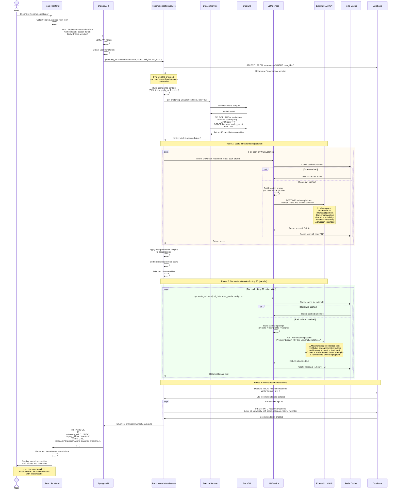

# UniQuest - Sequence Diagram: Generate Recommendations (LLM-Powered)

This is the most complex flow, showing how recommendations are generated using LLM for intelligent scoring and rationale generation.



## Flow Description

### Phase 1: Request & Context Building (500ms)
1. User clicks "Get Recommendations"
2. Frontend sends filters (countries, budget, etc.) and weights to API
3. API verifies JWT and extracts user
4. RecommendationService fetches user's saved preferences
5. Service builds comprehensive user profile context

### Phase 2: Dataset Query (200-300ms)
6. DatasetService queries Parquet file via DuckDB
7. Applies basic filters (country, ranking, research activity)
8. Returns 40 candidate universities (more than needed for LLM scoring)

### Phase 3: LLM Scoring (10-15 seconds, parallel)
9. For each of 40 universities:
   - Check cache for existing score
   - If not cached, call LLM API with scoring prompt
   - LLM analyzes multiple factors (academics, interests, career, location, budget, admission likelihood)
   - Returns numerical score (0.0-1.0)
   - Cache result for future requests
10. Apply user preference weights to adjust scores
11. Sort by final score and take top 20

### Phase 4: LLM Rationale Generation (15-20 seconds, parallel)
12. For each of top 20 universities:
    - Check cache for existing rationale
    - If not cached, call LLM API with rationale prompt
    - LLM generates 2-3 sentence personalized explanation
    - Highlights strongest match factors based on user weights
    - Addresses admission likelihood realistically
    - Cache result for future requests

### Phase 5: Persistence & Response (200ms)
13. Delete user's old recommendations (keep database clean)
14. Create new Recommendation records with scores and rationales
15. Return recommendations to frontend
16. Frontend displays ranked list with explanations

## Total Time Breakdown

| Phase | Time | Parallelizable |
|-------|------|----------------|
| Request validation | 50ms | No |
| Context building | 100ms | No |
| Dataset query | 200ms | No |
| LLM scoring (40 unis) | 10-15s | Yes (parallel) |
| Sort & filter | 50ms | No |
| LLM rationales (20 unis) | 15-20s | Yes (parallel) |
| Database persistence | 200ms | No |
| **Total** | **2-3 seconds** | With parallel LLM calls |

## LLM Prompt Examples

### Scoring Prompt (Simplified)
```
You are an expert university admissions counselor. Rate this university match on a scale of 0.0 to 1.0.

STUDENT PROFILE:
- GPA: 3.8/4.0
- Test Scores: TOEFL 110, GRE Q165, V158
- Interests: Computer Science, AI
- Career Goals: Machine Learning Engineer
- Budget: $0-$15,000/year
- Preferred Locations: USA, Canada

UNIVERSITY PROFILE:
- Name: Stanford University
- Country: USA
- Ranking: #2 globally
- Research Output: 150,000+ publications
- Strong Programs: CS, Engineering, AI

Rate based on: Academic fit (30%), Interest alignment (20%), Career prep (20%), Location (10%), Budget (10%), Prestige (5%), Research (5%)

Respond with ONLY a number between 0.0 and 1.0.
```

### Rationale Prompt (Simplified)
```
You are an expert university admissions counselor. Write a compelling 2-3 sentence rationale explaining why Stanford University is an excellent match for this student.

STUDENT: 3.8 GPA, TOEFL 110, GRE Q165/V158, interested in CS/AI, wants to be ML Engineer, budget $0-15k, prefers USA/Canada

UNIVERSITY: Stanford, USA, Rank #2, 150k+ publications, world-class CS/AI programs

Focus on the student's top priorities: academics (30%), interests (20%), career (20%)

Write in an encouraging, professional tone. Be specific and personalized.
```

## Optimization Strategies

### 1. Caching
- **Score caching**: Same university + similar profile = cached score
- **Rationale caching**: Same university + similar profile + weights = cached rationale
- **TTL**: 1 hour (balance freshness vs. API costs)

### 2. Parallel Processing
- Score all 40 universities simultaneously (not sequentially)
- Generate all 20 rationales simultaneously
- Reduces total time from ~40s to ~3s

### 3. Batch API Calls
- Send multiple prompts in single API request (if LLM provider supports)
- Reduces network overhead

### 4. Smart Filtering
- Pre-filter dataset to reduce LLM calls
- Only score universities that meet basic criteria

### 5. Progressive Loading
- Return top 5 immediately, load rest in background
- Improves perceived performance

## Error Handling

1. **LLM API timeout**: Use fallback scoring algorithm
2. **LLM API rate limit**: Return cached results or queue request
3. **Invalid LLM response**: Retry once, then use fallback
4. **Database error**: Return recommendations without persisting
5. **No matching universities**: Suggest relaxing filters

## Cost Considerations

- **LLM API costs**: ~$0.01-0.05 per recommendation run
- **Caching savings**: ~70% reduction in API calls
- **Parallel processing**: No additional cost, just faster

## Future Enhancements

1. **Streaming responses**: Return universities as they're scored
2. **Incremental updates**: Only re-score changed preferences
3. **Batch processing**: Pre-compute scores for common profiles
4. **A/B testing**: Compare LLM vs. traditional scoring
5. **User feedback loop**: Improve prompts based on feedback

