# UniQuest - Sequence Diagram: Submit Feedback & Refine

This diagram shows how users provide feedback and refine their recommendations.

```mermaid
sequenceDiagram
    actor User
    participant Frontend as React Frontend
    participant API as Django API
    participant DB as Database
    participant RecService as RecommendationService

    Note over User,DB: Phase 1: User reviews recommendations
    
    User->>Frontend: Browse recommendations list
    Frontend->>User: Display universities with scores & rationales
    
    User->>Frontend: Click on university card
    Frontend->>User: Show detailed view
    
    Note over User,Frontend: User decides to provide feedback
    
    rect rgb(255, 250, 240)
        Note over User,DB: Phase 2: Submit Feedback
        
        User->>Frontend: Click rating (1-5 stars)
        Frontend->>Frontend: Update UI to show selected rating
        
        User->>Frontend: Optionally add text notes
        Frontend->>Frontend: Enable submit button
        
        User->>Frontend: Click "Submit Feedback"
        
        Frontend->>API: POST /api/feedback/recommendations/{id}/<br/>Authorization: Bearer {token}<br/>Body: {rating: 4, notes: "Great match!"}
        
        API->>API: Verify JWT token
        API->>API: Extract user from token
        
        API->>DB: SELECT * FROM recommendations<br/>WHERE id = ? AND user_id = ?
        
        alt Recommendation exists and belongs to user
            DB->>API: Return recommendation
            
            API->>DB: INSERT INTO feedback<br/>(user_id, recommendation_id, rating, notes)<br/>ON CONFLICT (user_id, recommendation_id)<br/>DO UPDATE SET rating = ?, notes = ?
            
            Note over DB: Unique constraint ensures<br/>one feedback per user+recommendation
            
            DB->>API: Feedback saved
            
            API->>Frontend: HTTP 201 Created<br/>{id, rating, notes, created_at}
            
            Frontend->>Frontend: Update UI with success state
            Frontend->>User: Show "Thank you for your feedback!" toast
            
        else Recommendation not found or unauthorized
            DB->>API: Not found
            API->>Frontend: HTTP 404 Not Found
            Frontend->>User: Show error message
        end
    end
    
    Note over User,Frontend: User continues browsing
    
    User->>Frontend: Rate more recommendations
    Note over Frontend: Repeat feedback flow<br/>for each rating
    
    rect rgb(240, 255, 240)
        Note over User,RecService: Phase 3: Refine Recommendations
        
        User->>Frontend: Click "Refine Results" button
        Frontend->>User: Show preference adjustment modal
        
        Note over Frontend: Modal shows current weights:<br/>- Academics: 30%<br/>- Interests: 20%<br/>- Career: 20%<br/>- Location: 10%<br/>- Budget: 10%<br/>- Ranking: 5%<br/>- Research: 5%
        
        User->>Frontend: Adjust sliders<br/>(e.g., increase Location to 25%)
        Frontend->>Frontend: Update weight display in real-time
        Frontend->>Frontend: Show normalized weights
        
        User->>Frontend: Optionally adjust filters<br/>(e.g., add more countries)
        
        User->>Frontend: Click "Get New Recommendations"
        
        Frontend->>API: POST /api/recommendations/run/<br/>Authorization: Bearer {token}<br/>Body: {<br/>  filters: {countries: ["US", "CA", "UK"]},<br/>  weights: {academics: 0.25, location: 0.25, ...}<br/>}
        
        Note over API,RecService: Same recommendation flow as before<br/>(see Generate Recommendations diagram)
        
        API->>RecService: generate_recommendations(user, new_filters, new_weights)
        RecService->>RecService: Execute full recommendation pipeline
        RecService->>API: Return new recommendations
        
        API->>Frontend: HTTP 200 OK<br/>[{new recommendations with updated scores}]
        
        Frontend->>Frontend: Compare with previous results
        Frontend->>User: Display updated recommendations<br/>with "Refined" badge
        
        Note over Frontend: Optionally show:<br/>- What changed<br/>- Why rankings shifted<br/>- New universities that appeared
    end
    
    rect rgb(250, 240, 255)
        Note over User,DB: Phase 4: View Feedback History
        
        User->>Frontend: Click "My Feedback" in navigation
        
        Frontend->>API: GET /api/feedback/<br/>Authorization: Bearer {token}
        
        API->>API: Verify JWT token
        
        API->>DB: SELECT f.*, r.university_ref, r.score<br/>FROM feedback f<br/>JOIN recommendations r ON f.recommendation_id = r.id<br/>WHERE f.user_id = ?<br/>ORDER BY f.created_at DESC
        
        DB->>API: Return feedback history
        
        API->>Frontend: HTTP 200 OK<br/>[{<br/>  id, rating, notes,<br/>  university_name, score,<br/>  created_at<br/>}]
        
        Frontend->>User: Display feedback history table
        
        Note over User,Frontend: User can see:<br/>- All rated universities<br/>- Their ratings<br/>- Their notes<br/>- When they provided feedback
    end
    
    alt User wants to update feedback
        User->>Frontend: Click "Edit" on feedback
        Frontend->>User: Show edit modal with current rating/notes
        User->>Frontend: Update rating or notes
        Frontend->>API: PATCH /api/feedback/{id}/<br/>Body: {rating: 5, notes: "Updated!"}
        API->>DB: UPDATE feedback SET rating = ?, notes = ?
        DB->>API: Feedback updated
        API->>Frontend: HTTP 200 OK
        Frontend->>User: Show success message
    end
```



## Flow Description

### Phase 1: Browse Recommendations
1. User views list of recommended universities
2. Each card shows: name, location, score, rationale
3. User can click for detailed view

### Phase 2: Submit Feedback
4. User selects star rating (1-5)
5. User optionally adds text notes
6. Frontend sends feedback to API
7. API validates user owns the recommendation
8. Database stores feedback (unique per user+recommendation)
9. User sees confirmation

### Phase 3: Refine Recommendations
10. User clicks "Refine Results"
11. Modal shows current preference weights as sliders
12. User adjusts weights (e.g., increase "Location" importance)
13. User optionally adjusts filters (countries, budget, etc.)
14. Frontend sends new request with updated weights
15. Backend generates new recommendations using updated preferences
16. User sees updated results with explanation of changes

### Phase 4: View Feedback History
17. User navigates to "My Feedback" page
18. API returns all feedback with associated university info
19. User sees history of all ratings and notes
20. User can edit previous feedback if needed

## Feedback Data Model

```json
{
  "id": 123,
  "user_id": 456,
  "recommendation_id": 789,
  "rating": 4,
  "notes": "Great match for my interests, but tuition is a bit high",
  "created_at": "2025-10-28T10:30:00Z"
}
```

## Feedback Statistics

The system can use feedback to:
- **Improve recommendations**: Learn which factors matter most to user
- **Adjust weights automatically**: If user consistently rates high-ranking universities low, decrease "ranking" weight
- **Identify patterns**: Universities with high feedback scores are good matches
- **Quality control**: Low ratings indicate recommendation algorithm needs tuning

## Refinement Strategies

### 1. Weight Adjustment
```
Original weights:
- Academics: 30%
- Interests: 20%
- Career: 20%
- Location: 10%
- Budget: 10%
- Ranking: 5%
- Research: 5%

User increases Location to 25%:
- Academics: 25% (auto-adjusted)
- Interests: 17% (auto-adjusted)
- Career: 17% (auto-adjusted)
- Location: 25% (user set)
- Budget: 8% (auto-adjusted)
- Ranking: 4% (auto-adjusted)
- Research: 4% (auto-adjusted)
```

### 2. Filter Adjustment
- Add/remove countries
- Adjust budget range
- Change ranking threshold
- Toggle research activity requirement

### 3. Smart Suggestions
Based on feedback patterns:
- "You rated universities in Canada highly. Add more Canadian universities?"
- "You rated expensive universities low. Decrease budget max?"
- "You prefer research-intensive universities. Increase research weight?"

## UI/UX Considerations

### Feedback Form
- **Star rating**: Large, clickable stars (1-5)
- **Notes field**: Optional, expandable textarea
- **Submit button**: Only enabled when rating selected
- **Success feedback**: Toast notification + visual confirmation

### Refinement Modal
- **Weight sliders**: Visual sliders with percentage display
- **Real-time preview**: Show how weights affect scores
- **Reset button**: Return to default weights
- **Comparison**: Show old vs. new weights side-by-side

### Results Display
- **Refined badge**: Indicate these are updated results
- **Change indicators**: Show which universities moved up/down
- **Explanation**: Brief text explaining why results changed

## Performance Optimization

1. **Debounce slider changes**: Don't recalculate on every pixel movement
2. **Cache previous results**: Quick comparison without re-query
3. **Optimistic UI updates**: Show feedback immediately, sync in background
4. **Batch feedback**: If user rates multiple, send in single request

## Analytics Tracking

Track the following events:
- `feedback_submitted` - User rated a recommendation
- `feedback_positive` - Rating >= 4 stars
- `feedback_negative` - Rating <= 2 stars
- `refinement_started` - User opened refinement modal
- `weights_adjusted` - User changed preference weights
- `filters_adjusted` - User changed filters
- `recommendations_refined` - User generated new recommendations

## Error Scenarios

1. **Duplicate feedback**: Update existing feedback instead of error
2. **Recommendation deleted**: Return 404, suggest refreshing
3. **Invalid rating**: Validate 1-5 range on frontend and backend
4. **Network error**: Queue feedback locally, retry when online
5. **Refinement fails**: Show error, keep previous results visible

## Future Enhancements

1. **Feedback reasons**: Structured feedback (e.g., "Too expensive", "Wrong location")
2. **Comparison mode**: Rate multiple universities side-by-side
3. **Feedback analytics**: Show user their rating patterns
4. **Collaborative filtering**: "Users like you also liked..."
5. **Auto-refinement**: System suggests weight adjustments based on feedback
6. **A/B testing**: Test different refinement strategies

