# UniQuest - Use Case Diagram

This diagram shows all actors and their interactions with the UniQuest system.

```mermaid
graph TB
    subgraph System["UniQuest System"]
        subgraph Guest["Guest User Features"]
            UC1[Browse Landing Page]
            UC2[Upload CV]
            UC3[Fill Profile Form]
            UC4[View Prefilled Form]
            UC5[Generate Recommendations<br/>temporary]
            UC6[View University Details]
            UC7[Search Universities]
            UC8[Export Recommendations]
        end
        
        subgraph Auth["Authentication Features"]
            UC9[Sign Up via Auth0]
            UC10[Login via Auth0]
            UC11[Logout]
            UC12[Refresh Session]
        end
        
        subgraph Profile["Profile Management"]
            UC13[Save Student Profile]
            UC14[Update Profile]
            UC15[View Profile]
            UC16[Delete Profile Data]
        end
        
        subgraph Preferences["Preference Management"]
            UC17[Set Recommendation Weights]
            UC18[Update Preferences]
            UC19[View Preferences]
            UC20[Reset to Defaults]
        end
        
        subgraph Recommendations["Recommendation Features"]
            UC21[Generate Recommendations<br/>persistent]
            UC22[View Recommendation History]
            UC23[Refine Recommendations]
            UC24[Create Shortlist]
            UC25[Compare Universities]
        end
        
        subgraph Feedback["Feedback Features"]
            UC26[Rate Recommendation]
            UC27[Add Feedback Notes]
            UC28[View Feedback History]
            UC29[Edit Feedback]
        end
        
        subgraph Admin["Admin Features"]
            UC30[Download Dataset]
            UC31[Load Webometrics]
            UC32[Curate Dataset]
            UC33[Activate Dataset Version]
            UC34[Validate Dataset]
            UC35[View Ingestion History]
            UC36[Monitor System Health]
        end
        
        subgraph Internal["Internal System Use Cases"]
            UC37[Parse CV Client-Side]
            UC38[Verify JWT Token]
            UC39[Query Dataset]
            UC40[Score University Match]
            UC41[Generate Rationale]
            UC42[Calculate Recommendation Score]
            UC43[Persist User Data]
            UC44[Cache LLM Results]
        end
    end
    
    %% Actors
    GuestUser((Guest User))
    AuthStudent((Authenticated<br/>Student))
    Auth0((Auth0<br/>System))
    LLM((External<br/>LLM API))
    Admin((System<br/>Administrator))
    
    %% Guest User associations
    GuestUser --> UC1
    GuestUser --> UC2
    GuestUser --> UC3
    GuestUser --> UC4
    GuestUser --> UC5
    GuestUser --> UC6
    GuestUser --> UC7
    GuestUser --> UC8
    
    %% Authentication associations
    GuestUser --> UC9
    GuestUser --> UC10
    AuthStudent --> UC11
    AuthStudent --> UC12
    
    %% Authenticated Student associations
    AuthStudent --> UC13
    AuthStudent --> UC14
    AuthStudent --> UC15
    AuthStudent --> UC16
    AuthStudent --> UC17
    AuthStudent --> UC18
    AuthStudent --> UC19
    AuthStudent --> UC20
    AuthStudent --> UC21
    AuthStudent --> UC22
    AuthStudent --> UC23
    AuthStudent --> UC24
    AuthStudent --> UC25
    AuthStudent --> UC26
    AuthStudent --> UC27
    AuthStudent --> UC28
    AuthStudent --> UC29
    
    %% Admin associations
    Admin --> UC30
    Admin --> UC31
    Admin --> UC32
    Admin --> UC33
    Admin --> UC34
    Admin --> UC35
    Admin --> UC36
    
    %% Include relationships
    UC2 -.->|includes| UC37
    UC9 -.->|includes| UC38
    UC10 -.->|includes| UC38
    UC5 -.->|includes| UC39
    UC21 -.->|includes| UC39
    UC21 -.->|includes| UC40
    UC21 -.->|includes| UC41
    UC21 -.->|includes| UC42
    UC13 -.->|includes| UC43
    UC14 -.->|includes| UC43
    UC40 -.->|includes| UC44
    UC41 -.->|includes| UC44
    
    %% Extend relationships
    UC2 -.->|extends| UC3
    UC4 -.->|extends| UC3
    UC23 -.->|extends| UC21
    UC29 -.->|extends| UC26
    
    %% External system interactions
    UC9 --> Auth0
    UC10 --> Auth0
    UC38 --> Auth0
    UC40 --> LLM
    UC41 --> LLM
    
    %% Inheritance
    GuestUser -.->|inherits| AuthStudent
    
    style System fill:#f9f9f9,stroke:#333,stroke-width:2px
    style Guest fill:#e3f2fd,stroke:#1976d2,stroke-width:2px
    style Auth fill:#fff3e0,stroke:#f57c00,stroke-width:2px
    style Profile fill:#f3e5f5,stroke:#7b1fa2,stroke-width:2px
    style Preferences fill:#e8f5e9,stroke:#388e3c,stroke-width:2px
    style Recommendations fill:#fff9c4,stroke:#f9a825,stroke-width:2px
    style Feedback fill:#fce4ec,stroke:#c2185b,stroke-width:2px
    style Admin fill:#ffebee,stroke:#d32f2f,stroke-width:2px
    style Internal fill:#eceff1,stroke:#546e7a,stroke-width:2px
    
    style GuestUser fill:#90caf9,stroke:#1976d2,stroke-width:3px
    style AuthStudent fill:#ce93d8,stroke:#7b1fa2,stroke-width:3px
    style Auth0 fill:#ffcc80,stroke:#f57c00,stroke-width:3px
    style LLM fill:#a5d6a7,stroke:#388e3c,stroke-width:3px
    style Admin fill:#ef9a9a,stroke:#d32f2f,stroke-width:3px
```

## Actors

### 1. Guest User (Unauthenticated)
**Description**: A visitor to the platform who has not logged in yet.

**Capabilities**:
- Browse landing page and learn about the platform
- Upload CV for client-side parsing (no file upload to server)
- Fill profile form manually or review prefilled data
- Generate temporary recommendations (not saved)
- View university details
- Search universities in the dataset
- Export recommendations (CSV/PDF)

**Limitations**:
- Cannot save profile data permanently
- Cannot access recommendation history
- Cannot provide feedback
- Cannot create shortlists

### 2. Authenticated Student
**Description**: A logged-in user who can save data and access full features.

**Inherits from**: Guest User (all guest capabilities plus more)

**Additional Capabilities**:
- Save and update student profile
- Manage preference weights
- Generate persistent recommendations (saved to database)
- View recommendation history
- Refine recommendations with adjusted weights
- Create and manage shortlists
- Provide feedback (ratings and notes)
- View feedback history
- Compare universities side-by-side
- Delete all personal data

### 3. Auth0 System (External Actor)
**Description**: External authentication service handling user credentials.

**Responsibilities**:
- User registration and authentication
- JWT token generation and signing
- Token verification and validation
- Session management
- Social login integration (Google, etc.)

### 4. External LLM API (External Actor)
**Description**: External AI service for intelligent scoring and text generation.

**Responsibilities**:
- Score university-student matches (0.0-1.0)
- Generate personalized rationales
- Analyze student profiles
- Provide admission likelihood insights

### 5. System Administrator
**Description**: Technical administrator managing the platform and datasets.

**Capabilities**:
- Download university datasets from Kaggle
- Load Webometrics ranking data
- Curate and merge datasets
- Activate specific dataset versions
- Validate dataset integrity
- View ingestion run history
- Monitor system health
- Access API documentation

## Use Case Descriptions

### Guest User Features

**UC1: Browse Landing Page**
- View value proposition and features
- Learn how the platform works
- See example recommendations

**UC2: Upload CV**
- Select PDF file from device
- Client-side parsing (no upload to server)
- Extract structured data (GPA, tests, education)
- Includes: Parse CV Client-Side (UC37)

**UC3: Fill Profile Form**
- Enter academic information manually
- Set preferences and goals
- Specify budget and location preferences

**UC4: View Prefilled Form**
- Review CV-extracted data
- Edit any incorrect fields
- Add missing information
- Extends: Fill Profile Form (UC3)

**UC5: Generate Recommendations (Temporary)**
- Get university recommendations without login
- Results not saved to database
- Can export but not access later
- Includes: Query Dataset (UC39)

**UC6: View University Details**
- See comprehensive university information
- View rankings, research output, location
- Check admission requirements

**UC7: Search Universities**
- Search by name, country, ranking
- Filter by various criteria
- Browse dataset without recommendations

**UC8: Export Recommendations**
- Download as CSV or PDF
- Share via email or link
- Print-friendly format

### Authentication Features

**UC9: Sign Up via Auth0**
- Create new account
- Use email/password or social login
- Includes: Verify JWT Token (UC38)

**UC10: Login via Auth0**
- Authenticate existing user
- Receive JWT tokens
- Includes: Verify JWT Token (UC38)

**UC11: Logout**
- Clear session tokens
- Redirect to landing page

**UC12: Refresh Session**
- Silently renew expired tokens
- Maintain user session

### Profile Management

**UC13: Save Student Profile**
- Persist profile data to database
- Requires authentication
- Includes: Persist User Data (UC43)

**UC14: Update Profile**
- Modify existing profile fields
- Update GPA, test scores, goals
- Includes: Persist User Data (UC43)

**UC15: View Profile**
- Display current profile data
- Show completion percentage

**UC16: Delete Profile Data**
- Remove all personal data
- GDPR compliance
- Irreversible action

### Preference Management

**UC17: Set Recommendation Weights**
- Adjust importance of factors
- Academics, interests, career, location, etc.
- Weights sum to 100%

**UC18: Update Preferences**
- Modify existing weights
- Change filter preferences

**UC19: View Preferences**
- Display current weight settings
- Show filter preferences

**UC20: Reset to Defaults**
- Restore default weight values
- Clear custom preferences

### Recommendation Features

**UC21: Generate Recommendations (Persistent)**
- Create LLM-powered recommendations
- Save to database for history
- Includes: Query Dataset (UC39), Score University Match (UC40), Generate Rationale (UC41), Calculate Recommendation Score (UC42)

**UC22: View Recommendation History**
- See past recommendation runs
- Compare results over time
- Track changes

**UC23: Refine Recommendations**
- Adjust weights and regenerate
- Compare with previous results
- Extends: Generate Recommendations (UC21)

**UC24: Create Shortlist**
- Save favorite universities
- Add notes to shortlist items
- Export shortlist

**UC25: Compare Universities**
- Side-by-side comparison
- Highlight differences
- Decision support

### Feedback Features

**UC26: Rate Recommendation**
- Provide 1-5 star rating
- Indicate match quality

**UC27: Add Feedback Notes**
- Write detailed feedback
- Explain rating reasoning

**UC28: View Feedback History**
- See all past feedback
- Track rating patterns

**UC29: Edit Feedback**
- Update previous ratings
- Modify notes
- Extends: Rate Recommendation (UC26)

### Admin Features

**UC30: Download Dataset**
- Fetch from Kaggle API
- Specify version
- Track download progress

**UC31: Load Webometrics**
- Import ranking data
- Parse CSV format
- Merge with main dataset

**UC32: Curate Dataset**
- Clean and normalize data
- Merge multiple sources
- Convert to Parquet format

**UC33: Activate Dataset Version**
- Set active version
- Update symlink
- Switch datasets

**UC34: Validate Dataset**
- Check data integrity
- Verify required fields
- Generate statistics

**UC35: View Ingestion History**
- See all ingestion runs
- Check status and errors
- Review statistics

**UC36: Monitor System Health**
- Check API status
- Verify dataset availability
- Monitor performance

### Internal System Use Cases

**UC37: Parse CV Client-Side**
- Extract text from PDF
- Identify structured data
- Return JSON format

**UC38: Verify JWT Token**
- Validate signature with Auth0
- Check expiry and claims
- Extract user identity

**UC39: Query Dataset**
- Search Parquet files via DuckDB
- Apply filters
- Return matching universities

**UC40: Score University Match**
- Call LLM API with scoring prompt
- Receive numerical score
- Includes: Cache LLM Results (UC44)

**UC41: Generate Rationale**
- Call LLM API with rationale prompt
- Receive personalized text
- Includes: Cache LLM Results (UC44)

**UC42: Calculate Recommendation Score**
- Apply user preference weights
- Normalize scores
- Rank universities

**UC43: Persist User Data**
- Save to SQLite database
- Handle transactions
- Ensure data integrity

**UC44: Cache LLM Results**
- Store in Redis/memory cache
- Set TTL (1 hour)
- Reduce API costs

## Relationships

### Include Relationships (mandatory)
- Upload CV **includes** Parse CV Client-Side
- Sign Up/Login **includes** Verify JWT Token
- Generate Recommendations **includes** Query Dataset, Score Match, Generate Rationale, Calculate Score
- Save/Update Profile **includes** Persist User Data
- LLM operations **include** Cache Results

### Extend Relationships (optional)
- View Prefilled Form **extends** Fill Profile Form (only after CV upload)
- Refine Recommendations **extends** Generate Recommendations (only when adjusting)
- Edit Feedback **extends** Rate Recommendation (only when updating)

### Inheritance
- Authenticated Student **inherits from** Guest User (all guest features plus authenticated features)

## Access Control Matrix

| Use Case | Guest | Authenticated | Admin |
|----------|-------|---------------|-------|
| Browse Landing Page | ✅ | ✅ | ✅ |
| Upload CV | ✅ | ✅ | ❌ |
| Generate Temp Recommendations | ✅ | ✅ | ❌ |
| Save Profile | ❌ | ✅ | ❌ |
| Generate Persistent Recommendations | ❌ | ✅ | ❌ |
| Provide Feedback | ❌ | ✅ | ❌ |
| Download Dataset | ❌ | ❌ | ✅ |
| Validate Dataset | ❌ | ❌ | ✅ |

## Future Use Cases (Roadmap)

1. **UC50: Track Application Status** - Monitor university applications
2. **UC51: Set Deadline Reminders** - Email/push notifications
3. **UC52: Find Scholarships** - Match with financial aid opportunities
4. **UC53: Connect with Alumni** - Network with current students
5. **UC54: Virtual Campus Tours** - Explore universities virtually
6. **UC55: Document Management** - Store application documents
7. **UC56: Peer Comparison** - Compare profile with similar students
8. **UC57: University Reviews** - Read/write student reviews
9. **UC58: Application Checklist** - Track required documents
10. **UC59: Interview Preparation** - AI-powered interview practice

