# UniQuest - Activity Diagram: Complete User Journey

This diagram shows the complete user journey from landing page to receiving recommendations.

```mermaid
flowchart TD
    Start([User Visits Landing Page]) --> ViewLanding[View Value Proposition]
    ViewLanding --> Decision1{Entry Choice}
    
    Decision1 -->|Upload CV| UploadCV[Select PDF File]
    Decision1 -->|Fill Form| ManualForm[Fill Profile Form Manually]
    
    %% CV Upload Path
    UploadCV --> ParsePDF[Parse PDF Client-Side<br/>pdfjs-dist]
    ParsePDF --> ExtractData[Extract Structured Data<br/>GPA, Tests, Education]
    ExtractData --> ShowPrefilled[Display Prefilled Form]
    ShowPrefilled --> ReviewData[User Reviews Extracted Data]
    ReviewData --> Decision2{Data Correct?}
    Decision2 -->|No| EditFields[Edit Incorrect Fields]
    EditFields --> ReviewData
    Decision2 -->|Yes| MergePoint1[Continue]
    
    %% Manual Form Path
    ManualForm --> FillAcademics[Enter Academic Info<br/>GPA, Test Scores]
    FillAcademics --> FillInterests[Enter Interests & Goals]
    FillInterests --> FillPreferences[Set Location & Budget]
    FillPreferences --> MergePoint1
    
    %% Common Path After Form
    MergePoint1 --> SetWeights[Set Preference Weights<br/>or Use Defaults]
    SetWeights --> Decision3{Save Profile?}
    
    Decision3 -->|Yes - Login| RedirectAuth0[Redirect to Auth0 Login]
    RedirectAuth0 --> Auth0Login[User Authenticates<br/>Email/Google]
    Auth0Login --> ReceiveTokens[Receive JWT Tokens]
    ReceiveTokens --> SaveProfile[POST Profile to API]
    SaveProfile --> ProfileSaved[Profile Saved to Database]
    ProfileSaved --> MergePoint2[Continue]
    
    Decision3 -->|No - Guest| LocalStorage[Save to localStorage]
    LocalStorage --> MergePoint2
    
    %% Recommendation Generation
    MergePoint2 --> ClickRecommend[Click 'Get Recommendations']
    ClickRecommend --> ShowLoading[Show Loading Indicator]
    ShowLoading --> QueryDataset[Query Dataset<br/>DuckDB + Parquet]
    QueryDataset --> FilterCandidates[Filter 40 Candidate Universities]
    
    %% Parallel LLM Scoring
    FilterCandidates --> ParallelScore[Parallel: Score Each University]
    ParallelScore --> LLMScore1[LLM Score Uni 1]
    ParallelScore --> LLMScore2[LLM Score Uni 2]
    ParallelScore --> LLMScore3[LLM Score Uni ...]
    ParallelScore --> LLMScore4[LLM Score Uni 40]
    
    LLMScore1 --> JoinScores[Join: All Scored]
    LLMScore2 --> JoinScores
    LLMScore3 --> JoinScores
    LLMScore4 --> JoinScores
    
    JoinScores --> ApplyWeights[Apply User Preference Weights]
    ApplyWeights --> SortScores[Sort by Final Score]
    SortScores --> Top20[Take Top 20 Universities]
    
    %% Parallel Rationale Generation
    Top20 --> ParallelRationale[Parallel: Generate Rationales]
    ParallelRationale --> LLMRat1[LLM Rationale Uni 1]
    ParallelRationale --> LLMRat2[LLM Rationale Uni 2]
    ParallelRationale --> LLMRat3[LLM Rationale Uni ...]
    ParallelRationale --> LLMRat4[LLM Rationale Uni 20]
    
    LLMRat1 --> JoinRationales[Join: All Rationales Generated]
    LLMRat2 --> JoinRationales
    LLMRat3 --> JoinRationales
    LLMRat4 --> JoinRationales
    
    JoinRationales --> Decision4{User Authenticated?}
    Decision4 -->|Yes| SaveRecommendations[Save Recommendations to DB]
    SaveRecommendations --> MergePoint3[Continue]
    Decision4 -->|No| MergePoint3
    
    MergePoint3 --> DisplayResults[Display Ranked Universities<br/>with Scores & Rationales]
    
    %% User Reviews Results
    DisplayResults --> BrowseResults[User Browses Results]
    BrowseResults --> ViewDetails[View University Details]
    ViewDetails --> Decision5{Provide Feedback?}
    
    Decision5 -->|Yes| RateUniversity[Rate University 1-5 Stars]
    RateUniversity --> AddNotes[Optionally Add Notes]
    AddNotes --> SubmitFeedback[Submit Feedback]
    SubmitFeedback --> FeedbackSaved[Feedback Saved to DB]
    FeedbackSaved --> Decision6{Rate More?}
    Decision6 -->|Yes| BrowseResults
    Decision6 -->|No| Decision7{Refine Results?}
    
    Decision5 -->|No| Decision7{Refine Results?}
    
    %% Refinement Loop
    Decision7 -->|Yes| AdjustWeights[Adjust Preference Weights]
    AdjustWeights --> AdjustFilters[Optionally Adjust Filters]
    AdjustFilters --> ClickRecommend
    
    Decision7 -->|No| Decision8{Export or Shortlist?}
    
    %% Final Actions
    Decision8 -->|Export| ExportCSV[Export as CSV/PDF]
    ExportCSV --> End([Journey Complete])
    
    Decision8 -->|Shortlist| CreateShortlist[Add to Shortlist]
    CreateShortlist --> End
    
    Decision8 -->|Done| End
    
    %% Styling
    classDef userAction fill:#e3f2fd,stroke:#1976d2,stroke-width:2px
    classDef systemAction fill:#fff3e0,stroke:#f57c00,stroke-width:2px
    classDef llmAction fill:#e8f5e9,stroke:#388e3c,stroke-width:2px
    classDef decision fill:#fff9c4,stroke:#f9a825,stroke-width:2px
    classDef endpoint fill:#ffebee,stroke:#d32f2f,stroke-width:3px
    
    class ViewLanding,UploadCV,ManualForm,ReviewData,EditFields,FillAcademics,FillInterests,FillPreferences,SetWeights,Auth0Login,ClickRecommend,BrowseResults,ViewDetails,RateUniversity,AddNotes,AdjustWeights,AdjustFilters,ExportCSV,CreateShortlist userAction
    
    class ParsePDF,ExtractData,ShowPrefilled,RedirectAuth0,ReceiveTokens,SaveProfile,ProfileSaved,LocalStorage,ShowLoading,QueryDataset,FilterCandidates,ApplyWeights,SortScores,Top20,SaveRecommendations,DisplayResults,SubmitFeedback,FeedbackSaved systemAction
    
    class LLMScore1,LLMScore2,LLMScore3,LLMScore4,LLMRat1,LLMRat2,LLMRat3,LLMRat4,ParallelScore,ParallelRationale,JoinScores,JoinRationales llmAction
    
    class Decision1,Decision2,Decision3,Decision4,Decision5,Decision6,Decision7,Decision8 decision
    
    class Start,End endpoint
```

## Journey Phases

### Phase 1: Entry & Profile Creation (2-3 minutes)
- User chooses between CV upload or manual form
- CV path: Parse PDF → Review prefilled data → Edit if needed
- Manual path: Fill academic info → Interests → Preferences
- Both paths converge at preference weights

### Phase 2: Authentication (Optional, 30 seconds)
- User decides whether to login (save data) or continue as guest
- If login: Auth0 redirect → Authenticate → Save profile to database
- If guest: Save to localStorage (temporary)

### Phase 3: Recommendation Generation (2-3 seconds)
- Query dataset with filters (40 candidates)
- **Parallel LLM scoring** (all 40 universities scored simultaneously)
- Apply user weights and sort
- **Parallel rationale generation** (top 20 universities)
- Save to database if authenticated

### Phase 4: Review & Feedback (Variable)
- User browses ranked recommendations
- Views university details
- Provides ratings and notes (optional)
- Can rate multiple universities

### Phase 5: Refinement (Optional)
- Adjust preference weights
- Modify filters
- Loop back to recommendation generation
- Compare new results with previous

### Phase 6: Final Actions
- Export recommendations (CSV/PDF)
- Create shortlist
- Journey complete

## Key Decision Points

1. **Entry Choice**: Upload CV vs. Manual Form
2. **Data Correct**: Accept prefilled data vs. Edit
3. **Save Profile**: Login vs. Continue as Guest
4. **Provide Feedback**: Rate universities vs. Skip
5. **Refine Results**: Adjust weights vs. Accept results
6. **Final Action**: Export, Shortlist, or Done

## Parallel Processing

### LLM Scoring (Parallel)
- All 40 candidate universities scored simultaneously
- Reduces time from 40 seconds to ~2 seconds
- Each score: 0.0-1.0 based on match quality

### Rationale Generation (Parallel)
- Top 20 universities get rationales simultaneously
- Reduces time from 30 seconds to ~2 seconds
- Each rationale: 2-3 personalized sentences

## Time Estimates

| Phase | Time | Notes |
|-------|------|-------|
| Landing to Form | 30s | User reading |
| CV Upload & Parse | 2-3s | Client-side |
| Form Filling | 2-5min | Manual entry |
| Auth0 Login | 10-15s | External redirect |
| Recommendation Gen | 2-3s | With parallel LLM |
| Review Results | 2-5min | User browsing |
| Provide Feedback | 30s | Per university |
| Refinement | 2-3s | Regenerate |
| **Total (CV path)** | **5-8min** | First-time user |
| **Total (returning)** | **30s** | Just recommendations |

## Error Handling

- **PDF Parse Fails**: Offer manual form entry
- **Auth0 Timeout**: Allow guest mode, retry later
- **LLM API Error**: Use fallback scoring algorithm
- **Database Error**: Show recommendations without saving
- **No Matches**: Suggest relaxing filters

## Success Metrics

- **Completion Rate**: % of users who reach recommendations
- **CV Upload Success**: % of successful CV parses
- **Auth Conversion**: % of guests who login
- **Feedback Rate**: % of users who provide ratings
- **Refinement Rate**: % of users who refine results
- **Export Rate**: % of users who export/shortlist

