# UniQuest - Activity Diagram: Dataset Ingestion Pipeline

This diagram shows the admin workflow for updating the university dataset.

```mermaid
flowchart TD
    Start([Admin Initiates Dataset Update]) --> CreateRun[Create IngestionRun Record<br/>Status: PENDING]
    CreateRun --> UpdateRunning[Update Status: RUNNING]
    
    UpdateRunning --> ConfigKaggle[Configure Kaggle API Credentials]
    ConfigKaggle --> DownloadCmd[Run: python manage.py download_dataset<br/>--version 2025.09]
    
    DownloadCmd --> ConnectKaggle[Connect to Kaggle API]
    ConnectKaggle --> Decision1{Dataset Exists?}
    
    Decision1 -->|No| ErrorNotFound[Log Error: Dataset Not Found]
    ErrorNotFound --> UpdateFailed1[Update Status: FAILED]
    UpdateFailed1 --> End([End])
    
    Decision1 -->|Yes| DownloadData[Download Dataset Files<br/>CSV/JSONL]
    DownloadData --> ShowProgress[Show Download Progress]
    ShowProgress --> SaveRaw[Save to /data/raw/openalex/2025.09/]
    
    SaveRaw --> Decision2{Load Webometrics?}
    
    Decision2 -->|Yes| WebometricsCmd[Run: python manage.py load_webometrics<br/>--version 2025.09 --csv path]
    WebometricsCmd --> ParseCSV[Parse Webometrics CSV]
    ParseCSV --> ValidateRankings[Validate Ranking Data]
    ValidateRankings --> Decision3{Valid Data?}
    
    Decision3 -->|No| WarnInvalid[Log Warning: Invalid Rankings]
    WarnInvalid --> ContinueWithout[Continue Without Rankings]
    ContinueWithout --> MergePoint1[Continue]
    
    Decision3 -->|Yes| SaveWebometrics[Save to /data/raw/webometrics/2025.09/]
    SaveWebometrics --> MergePoint1
    
    Decision2 -->|No| MergePoint1
    
    %% Curation Phase
    MergePoint1 --> CurateCmd[Run: python manage.py curate<br/>--version 2025.09]
    CurateCmd --> LoadOpenAlex[Load OpenAlex JSONL Data]
    LoadOpenAlex --> ParseInstitutions[Parse Institution Records]
    
    ParseInstitutions --> Decision4{Webometrics Available?}
    Decision4 -->|Yes| LoadWebRankings[Load Webometrics Rankings]
    LoadWebRankings --> MergeData[Merge Datasets by Institution Name/ID]
    MergeData --> MergePoint2[Continue]
    
    Decision4 -->|No| MergePoint2
    
    MergePoint2 --> NormalizeFields[Normalize Fields<br/>Country Codes, Rankings, URLs]
    NormalizeFields --> RemoveDuplicates[Remove Duplicate Institutions]
    RemoveDuplicates --> ValidateRequired[Validate Required Fields<br/>name, country, id]
    
    ValidateRequired --> Decision5{All Valid?}
    Decision5 -->|No| LogErrors[Log Validation Errors]
    LogErrors --> FilterInvalid[Filter Out Invalid Records]
    FilterInvalid --> MergePoint3[Continue]
    
    Decision5 -->|Yes| MergePoint3
    
    MergePoint3 --> ConvertParquet[Convert to Parquet Format]
    ConvertParquet --> SaveCurated[Save to /data/curated/2025.09/institutions.parquet]
    SaveCurated --> CreateIndex[Create Search Index]
    CreateIndex --> SaveIndex[Save search_index.parquet]
    
    SaveIndex --> UpdateStats[Update IngestionRun Stats<br/>record_count, countries, etc.]
    
    %% Validation Phase
    UpdateStats --> ValidateCmd[Run: python manage.py validate<br/>--version 2025.09 --verbose]
    ValidateCmd --> LoadDuckDB[Load Parquet into DuckDB]
    LoadDuckDB --> RunChecks[Run Validation Queries]
    
    RunChecks --> CheckCount[Check: Total Record Count > 0]
    CheckCount --> CheckCountries[Check: Countries > 50]
    CheckCountries --> CheckNulls[Check: Required Fields Not Null]
    CheckNulls --> CheckDuplicates[Check: No Duplicate IDs]
    CheckDuplicates --> CheckRankings[Check: Rankings in Valid Range]
    
    CheckRankings --> Decision6{All Checks Passed?}
    
    Decision6 -->|No| LogValidationErrors[Log Validation Failures]
    LogValidationErrors --> UpdateFailed2[Update Status: FAILED<br/>Save Error Details]
    UpdateFailed2 --> NotifyAdmin[Notify Admin of Failure]
    NotifyAdmin --> End
    
    Decision6 -->|Yes| UpdateSuccess[Update Status: SUCCESS]
    UpdateSuccess --> LogStats[Log Dataset Statistics<br/>Total: X institutions<br/>Countries: Y<br/>Ranked: Z]
    
    LogStats --> Decision7{Activate Now?}
    
    Decision7 -->|Yes| ActivateCmd[Run: python manage.py activate<br/>--version 2025.09]
    ActivateCmd --> UpdateSymlink[Update /data/current → 2025.09]
    UpdateSymlink --> ClearCache[Clear Query Cache]
    ClearCache --> NotifySuccess[Notify Admin: Dataset Active]
    NotifySuccess --> End
    
    Decision7 -->|No| NotifyReady[Notify Admin: Dataset Ready<br/>Activate Manually When Ready]
    NotifyReady --> End
    
    %% Styling
    classDef adminAction fill:#ffebee,stroke:#d32f2f,stroke-width:2px
    classDef systemAction fill:#e3f2fd,stroke:#1976d2,stroke-width:2px
    classDef validation fill:#fff3e0,stroke:#f57c00,stroke-width:2px
    classDef decision fill:#fff9c4,stroke:#f9a825,stroke-width:2px
    classDef error fill:#fce4ec,stroke:#c2185b,stroke-width:2px
    classDef success fill:#e8f5e9,stroke:#388e3c,stroke-width:2px
    classDef endpoint fill:#eceff1,stroke:#546e7a,stroke-width:3px
    
    class ConfigKaggle,DownloadCmd,WebometricsCmd,CurateCmd,ValidateCmd,ActivateCmd,NotifyAdmin,NotifySuccess,NotifyReady adminAction
    
    class CreateRun,UpdateRunning,ConnectKaggle,DownloadData,ShowProgress,SaveRaw,ParseCSV,SaveWebometrics,LoadOpenAlex,ParseInstitutions,LoadWebRankings,MergeData,NormalizeFields,RemoveDuplicates,ConvertParquet,SaveCurated,CreateIndex,SaveIndex,UpdateStats,LoadDuckDB,UpdateSymlink,ClearCache systemAction
    
    class ValidateRankings,ValidateRequired,FilterInvalid,RunChecks,CheckCount,CheckCountries,CheckNulls,CheckDuplicates,CheckRankings validation
    
    class Decision1,Decision2,Decision3,Decision4,Decision5,Decision6,Decision7 decision
    
    class ErrorNotFound,UpdateFailed1,WarnInvalid,LogErrors,LogValidationErrors,UpdateFailed2 error
    
    class UpdateSuccess,LogStats success
    
    class Start,End endpoint
```



## Pipeline Phases

### Phase 1: Download (5-10 minutes)
1. Admin runs download command with version number
2. System creates IngestionRun record (tracks progress)
3. Connect to Kaggle API with credentials
4. Download university dataset (CSV/JSONL format)
5. Save to `/data/raw/openalex/{version}/`
6. Optionally download Webometrics rankings

### Phase 2: Curation (10-15 minutes)
7. Load OpenAlex institution data
8. Parse and validate records
9. If available, load Webometrics rankings
10. Merge datasets by institution name/ID matching
11. Normalize fields (country codes, URLs, rankings)
12. Remove duplicates
13. Validate required fields
14. Convert to Parquet format (efficient storage)
15. Create search index
16. Update ingestion statistics

### Phase 3: Validation (2-3 minutes)
17. Load Parquet into DuckDB
18. Run validation queries:
    - Total record count > 0
    - Number of countries > 50
    - Required fields not null
    - No duplicate IDs
    - Rankings in valid range (1-10000)
19. If validation fails: Mark as FAILED, log errors
20. If validation passes: Mark as SUCCESS

### Phase 4: Activation (30 seconds)
21. Admin decides whether to activate immediately
22. If yes: Update `/data/current` symlink to new version
23. Clear query cache
24. Notify admin of success

## Commands

```bash
# Step 1: Download dataset
python manage.py download_dataset \
  --version 2025.09 \
  --kaggle-dataset "mylesoneill/world-university-rankings"

# Step 2: Load rankings (optional)
python manage.py load_webometrics \
  --version 2025.09 \
  --csv /path/to/webometrics.csv

# Step 3: Curate and merge
python manage.py curate --version 2025.09

# Step 4: Validate
python manage.py validate --version 2025.09 --verbose

# Step 5: Activate
python manage.py activate --version 2025.09
```

## Validation Checks

| Check | Criteria | Action if Failed |
|-------|----------|------------------|
| Record Count | > 0 institutions | FAIL - No data |
| Countries | > 50 countries | WARN - Limited coverage |
| Required Fields | name, id, country not null | FAIL - Invalid records |
| Duplicate IDs | No duplicate OpenAlex IDs | FAIL - Data integrity issue |
| Ranking Range | 1 ≤ rank ≤ 10000 | WARN - Filter invalid ranks |
| URL Format | Valid HTTP/HTTPS URLs | WARN - Fix URLs |

## Data Transformations

### Country Code Normalization
```
"United States" → "US"
"United Kingdom" → "GB"
"Germany" → "DE"
```

### Ranking Normalization
```
Webometrics: "Top 100" → rank: 100
OpenAlex: works_count → research_score
```

### Deduplication Strategy
```
1. Match by OpenAlex ID (exact)
2. Match by name + country (fuzzy)
3. Keep record with most complete data
```

## Error Handling

1. **Kaggle API Failure**: Retry 3 times, then fail
2. **Invalid CSV Format**: Log error, skip invalid rows
3. **Merge Conflicts**: Keep OpenAlex as source of truth
4. **Validation Failure**: Don't activate, notify admin
5. **Disk Space**: Check before download, fail if insufficient

## Monitoring

### IngestionRun Statistics
```json
{
  "total_records": 25000,
  "countries": 180,
  "ranked_institutions": 5000,
  "download_time_seconds": 420,
  "curation_time_seconds": 850,
  "validation_time_seconds": 120,
  "total_time_seconds": 1390,
  "file_size_mb": 450
}
```

## Rollback Strategy

If new version has issues:
```bash
# Revert to previous version
python manage.py activate --version 2025.08

# Delete failed version
rm -rf /data/curated/2025.09/
```

## Future Enhancements

1. **Incremental Updates**: Only download changed records
2. **Parallel Processing**: Speed up curation
3. **Data Quality Scores**: Rate completeness of each record
4. **Automated Scheduling**: Cron job for monthly updates
5. **Version Comparison**: Diff tool to compare versions

