# UniQuest - Swimlane Diagram: Recommendation Generation Workflow

This diagram shows the cross-functional workflow for generating LLM-powered recommendations.

```mermaid
graph TB
    subgraph Student["👤 Student"]
        S1[Click 'Get Recommendations']
        S2[Wait for results...]
        S3[Review ranked universities]
    end
    
    subgraph Frontend["⚛️ React Frontend"]
        F1[Receive click event]
        F2[Collect filters & weights]
        F3[Show loading spinner]
        F4[POST /api/recommendations/run/]
        F5[Receive recommendations JSON]
        F6[Parse and render results]
        F7[Display universities with rationales]
    end
    
    subgraph API["🔧 Django API"]
        A1[Receive POST request]
        A2[Verify JWT token]
        A3[Extract user from token]
        A4[Call RecommendationService]
        A5[Wait for service response]
        A6[Format response as JSON]
        A7[Return HTTP 200]
    end
    
    subgraph RecService["🎯 Recommendation Service"]
        R1[generate_recommendations]
        R2[Fetch user Preference]
        R3[Build user profile context]
        R4[Call DatasetService]
        R5[Receive 40 candidates]
        R6[Loop: Score each university]
        R7[Sort by score, take top 20]
        R8[Loop: Generate rationales]
        R9[Delete old recommendations]
        R10[Create new recommendations]
        R11[Return recommendations list]
    end
    
    subgraph DataService["💾 Dataset Service"]
        D1[get_matching_universities]
        D2[Load institutions.parquet]
        D3[Build SQL query with filters]
        D4[Execute query on DuckDB]
        D5[Convert results to dicts]
        D6[Return university list]
    end
    
    subgraph LLMService["🤖 LLM Service"]
        L1[score_university_match]
        L2[Check cache for score]
        L3[Build scoring prompt]
        L4[Call External LLM API]
        L5[Receive score 0.0-1.0]
        L6[Cache result]
        L7[Return score]
        L8[generate_rationale]
        L9[Check cache for rationale]
        L10[Build rationale prompt]
        L11[Call External LLM API]
        L12[Receive rationale text]
        L13[Cache result]
        L14[Return rationale]
    end
    
    subgraph ExternalLLM["☁️ External LLM API"]
        E1[Receive scoring prompt]
        E2[Process with language model]
        E3[Return numerical score]
        E4[Receive rationale prompt]
        E5[Generate personalized text]
        E6[Return rationale]
    end
    
    subgraph Database["🗄️ Database SQLite"]
        DB1[SELECT preferences]
        DB2[Return user weights]
        DB3[DELETE old recommendations]
        DB4[INSERT new recommendations]
        DB5[Return success]
    end
    
    subgraph DuckDB["📊 DuckDB"]
        DU1[Load Parquet file]
        DU2[Execute SQL query]
        DU3[Return 40 universities]
    end
    
    %% Flow connections
    S1 --> F1
    F1 --> F2
    F2 --> F3
    F3 --> F4
    F4 --> A1
    A1 --> A2
    A2 --> A3
    A3 --> A4
    A4 --> R1
    R1 --> R2
    R2 --> DB1
    DB1 --> DB2
    DB2 --> R3
    R3 --> R4
    R4 --> D1
    D1 --> D2
    D2 --> DU1
    DU1 --> D3
    D3 --> D4
    D4 --> DU2
    DU2 --> DU3
    DU3 --> D5
    D5 --> D6
    D6 --> R5
    R5 --> R6
    R6 --> L1
    L1 --> L2
    L2 --> L3
    L3 --> L4
    L4 --> E1
    E1 --> E2
    E2 --> E3
    E3 --> L5
    L5 --> L6
    L6 --> L7
    L7 --> R7
    R7 --> R8
    R8 --> L8
    L8 --> L9
    L9 --> L10
    L10 --> L11
    L11 --> E4
    E4 --> E5
    E5 --> E6
    E6 --> L12
    L12 --> L13
    L13 --> L14
    L14 --> R9
    R9 --> DB3
    DB3 --> R10
    R10 --> DB4
    DB4 --> DB5
    DB5 --> R11
    R11 --> A5
    A5 --> A6
    A6 --> A7
    A7 --> F5
    F5 --> F6
    F6 --> F7
    F7 --> S2
    S2 --> S3
    
    %% Styling
    classDef studentStyle fill:#e3f2fd,stroke:#1976d2,stroke-width:3px
    classDef frontendStyle fill:#fff3e0,stroke:#f57c00,stroke-width:2px
    classDef apiStyle fill:#f3e5f5,stroke:#7b1fa2,stroke-width:2px
    classDef serviceStyle fill:#e8f5e9,stroke:#388e3c,stroke-width:2px
    classDef llmStyle fill:#fff9c4,stroke:#f9a825,stroke-width:2px
    classDef externalStyle fill:#fce4ec,stroke:#c2185b,stroke-width:2px
    classDef dbStyle fill:#ffebee,stroke:#d32f2f,stroke-width:2px
    
    class Student studentStyle
    class Frontend frontendStyle
    class API apiStyle
    class RecService,DataService serviceStyle
    class LLMService llmStyle
    class ExternalLLM externalStyle
    class Database,DuckDB dbStyle
```



## Detailed Flow Description

### Lane 1: Student (User)
**Actions:**
1. Clicks "Get Recommendations" button
2. Waits while system processes (2-3 seconds)
3. Reviews ranked list of universities with explanations

**Time:** ~3 seconds total

---

### Lane 2: React Frontend
**Actions:**
1. Receives button click event
2. Collects filters (countries, budget) and weights from form state
3. Shows loading spinner with progress message
4. Makes POST request to `/api/recommendations/run/` with JWT token
5. Receives JSON response with recommendations
6. Parses data and prepares UI components
7. Displays ranked universities with scores and rationales

**Key Data:**
```javascript
// Request
{
  filters: {
    countries: ["US", "CA", "UK"],
    max_rank: 500,
    budget_max: 50000
  },
  weights: {
    academics: 0.3,
    interests: 0.2,
    career: 0.2,
    location: 0.15,
    budget: 0.15
  }
}

// Response
[
  {
    id: 123,
    university_ref: "I123456",
    display_name: "Stanford University",
    score: 0.92,
    rationale: "Stanford's world-class CS program...",
    country_code: "US",
    ranking: 2
  },
  // ... 19 more
]
```

**Time:** ~500ms (excluding API wait)

---

### Lane 3: Django API
**Actions:**
1. Receives POST request with Authorization header
2. Verifies JWT token with Auth0 (signature, expiry, audience)
3. Extracts user ID from token's `sub` claim
4. Calls `RecommendationService.generate_recommendations()`
5. Waits for service to complete (most time spent here)
6. Formats recommendations as JSON
7. Returns HTTP 200 OK with data

**Security:**
- JWT verification on every request
- User can only generate recommendations for themselves
- Rate limiting applied (future enhancement)

**Time:** ~50ms (excluding service wait)

---

### Lane 4: Recommendation Service
**Actions:**
1. Receives `generate_recommendations(user, filters, weights, top_n=20)`
2. Fetches user's saved Preference weights from database
3. Builds comprehensive user profile (GPA, tests, goals, preferences)
4. Calls `DatasetService.get_matching_universities(filters, limit=40)`
5. Receives 40 candidate universities
6. **Loop:** For each of 40 universities:
   - Calls `LLMService.score_university_match()`
   - Receives score (0.0-1.0)
7. Applies user preference weights to adjust scores
8. Sorts by final score, takes top 20
9. **Loop:** For each of top 20:
   - Calls `LLMService.generate_rationale()`
   - Receives personalized text
10. Deletes user's old recommendations (keep DB clean)
11. Creates 20 new Recommendation records
12. Returns list of recommendations

**Business Logic:**
- Weights are normalized to sum to 1.0
- Scores are clamped to [0.0, 1.0] range
- Old recommendations deleted to avoid clutter
- Filters and weights snapshot saved with each recommendation

**Time:** ~2-3 seconds (mostly LLM calls)

---

### Lane 5: Dataset Service
**Actions:**
1. Receives `get_matching_universities(filters, limit=40)`
2. Loads `institutions.parquet` into DuckDB connection
3. Builds SQL query with WHERE clause from filters
4. Executes query on DuckDB
5. Converts result rows to Python dictionaries
6. Returns list of 40 universities

**Query Example:**
```sql
SELECT 
    id, display_name, country_code, 
    webometrics_rank, works_count, 
    cited_by_count, homepage_url
FROM institutions
WHERE country_code IN ('US', 'CA', 'UK')
  AND webometrics_rank <= 500
ORDER BY webometrics_rank ASC, works_count DESC
LIMIT 40
```

**Time:** ~200ms (DuckDB is very fast on Parquet)

---

### Lane 6: LLM Service
**Actions (Scoring):**
1. Receives `score_university_match(uni_data, user_profile)`
2. Checks Redis cache for existing score
3. If not cached:
   - Builds comprehensive scoring prompt
   - Calls External LLM API
   - Receives numerical score
   - Caches result (1 hour TTL)
4. Returns score to caller

**Actions (Rationale):**
8. Receives `generate_rationale(uni_data, user_profile, weights)`
9. Checks Redis cache for existing rationale
10. If not cached:
    - Builds personalized rationale prompt
    - Calls External LLM API
    - Receives 2-3 sentence text
    - Caches result (1 hour TTL)
14. Returns rationale to caller

**Optimization:**
- Caching reduces API calls by ~70%
- Parallel processing (all scores/rationales generated simultaneously)
- Fallback to rule-based scoring if LLM fails

**Time per call:** 
- Cached: ~10ms
- Uncached: ~500-1000ms

---

### Lane 7: External LLM API
**Actions (Scoring):**
1. Receives scoring prompt with university + student data
2. Processes with language model (GPT-4, Claude, etc.)
3. Returns numerical score (0.0-1.0)

**Actions (Rationale):**
4. Receives rationale prompt with university + student data
5. Generates personalized 2-3 sentence explanation
6. Returns rationale text

**API Call Example:**
```json
{
  "model": "gpt-4",
  "messages": [
    {
      "role": "system",
      "content": "You are an expert university counselor..."
    },
    {
      "role": "user",
      "content": "Rate this match: Student (GPA 3.8, CS major) → Stanford (Rank #2, CS strength)..."
    }
  ],
  "temperature": 0.3
}
```

**Time per call:** ~500-1000ms

---

### Lane 8: Database (SQLite)
**Actions:**
1. Receives SELECT query for user preferences
2. Returns user's weight settings
3. Receives DELETE query for old recommendations
4. Receives INSERT queries for 20 new recommendations (batch)
5. Returns success confirmation

**Transactions:**
- All inserts wrapped in transaction
- Rollback if any insert fails
- Ensures data consistency

**Time:** ~200ms total

---

### Lane 9: DuckDB
**Actions:**
1. Loads Parquet file into memory (if not already loaded)
2. Executes SQL query with filters
3. Returns 40 matching universities

**Performance:**
- Parquet columnar format = fast filtering
- DuckDB optimized for analytical queries
- Can handle millions of rows efficiently

**Time:** ~100-200ms

---

## Parallel Processing

### Phase 1: Scoring (Parallel)
```
Uni 1 → LLM → Score 1 ─┐
Uni 2 → LLM → Score 2 ─┤
Uni 3 → LLM → Score 3 ─┼→ Join → Sort
...                     │
Uni 40 → LLM → Score 40─┘
```
**Time:** 2 seconds (parallel) vs. 40 seconds (sequential)

### Phase 2: Rationales (Parallel)
```
Top 1 → LLM → Rationale 1 ─┐
Top 2 → LLM → Rationale 2 ─┤
Top 3 → LLM → Rationale 3 ─┼→ Join → Save
...                         │
Top 20 → LLM → Rationale 20─┘
```
**Time:** 2 seconds (parallel) vs. 30 seconds (sequential)

## Error Handling by Lane

| Lane | Error | Handling |
|------|-------|----------|
| Frontend | Network timeout | Retry 3x, show error |
| API | Invalid JWT | Return 401 Unauthorized |
| RecService | No candidates | Suggest relaxing filters |
| DataService | Parquet not found | Return 500, log error |
| LLMService | API timeout | Use fallback scoring |
| ExternalLLM | Rate limit | Queue request, retry |
| Database | Constraint violation | Rollback transaction |
| DuckDB | Query error | Log error, return empty |

## Performance Bottlenecks

1. **LLM API calls** (80% of time)
   - Solution: Caching + parallel processing
2. **Database writes** (10% of time)
   - Solution: Batch inserts
3. **Dataset query** (10% of time)
   - Solution: DuckDB optimization

## Future Optimizations

1. **Streaming responses**: Return top 5 immediately, load rest in background
2. **Predictive caching**: Pre-compute scores for common profiles
3. **Batch LLM calls**: Send multiple prompts in single API request
4. **Progressive enhancement**: Show basic scores first, add rationales later
5. **WebSocket updates**: Real-time progress updates to frontend

