# UniQuest - Swimlane Diagram: User Authentication & Profile Setup

This diagram shows the authentication flow using Auth0 and profile creation.

```mermaid
graph TB
    subgraph Student["👤 Student"]
        S1[Click 'Login to Save Profile']
        S2[Redirected to Auth0 page]
        S3[Enter credentials or use Google]
        S4[Redirected back to app]
        S5[See 'Profile Saved' message]
    end
    
    subgraph Frontend["⚛️ React Frontend"]
        F1[Receive login click]
        F2[Redirect to Auth0 Universal Login<br/>PKCE flow]
        F3[Wait for Auth0 callback]
        F4[Receive authorization code]
        F5[Exchange code for tokens]
        F6[Store tokens in memory<br/>Auth0 SDK]
        F7[POST /api/students/me/<br/>with access token & profile data]
        F8[Receive profile response]
        F9[Update UI state]
        F10[Show success message]
    end
    
    subgraph Auth0["🔐 Auth0 OIDC"]
        A1[Display Universal Login page]
        A2[Validate credentials]
        A3[Check if user exists]
        A4[Create Auth0 user record<br/>if new]
        A5[Generate JWT tokens<br/>ID + Access]
        A6[Sign tokens with private key]
        A7[Redirect to callback URL<br/>with authorization code]
        A8[Receive token exchange request]
        A9[Validate authorization code]
        A10[Return JWT tokens]
    end
    
    subgraph API["🔧 Django API"]
        AP1[Receive POST /api/students/me/]
        AP2[Extract JWT from<br/>Authorization header]
        AP3[Verify JWT signature<br/>with Auth0 JWKS]
        AP4[Verify issuer Auth0 domain]
        AP5[Verify audience API identifier]
        AP6[Extract 'sub' claim<br/>Auth0 user ID]
        AP7[Check if User exists<br/>by auth0_sub]
        AP8[Create User record<br/>if not found]
        AP9[Upsert StudentProfile<br/>with request data]
        AP10[Return profile JSON]
    end
    
    subgraph Database["🗄️ Database SQLite"]
        DB1[SELECT * FROM users<br/>WHERE auth0_sub = ?]
        DB2[Return user or NULL]
        DB3[INSERT INTO users<br/>email, auth0_sub, name]
        DB4[Return new user object]
        DB5[INSERT or UPDATE<br/>student_profiles]
        DB6[Return profile object]
    end
    
    %% Flow connections
    S1 --> F1
    F1 --> F2
    F2 --> A1
    A1 --> S2
    S2 --> S3
    S3 --> A2
    A2 --> A3
    A3 --> A4
    A4 --> A5
    A5 --> A6
    A6 --> A7
    A7 --> S4
    S4 --> F3
    F3 --> F4
    F4 --> F5
    F5 --> A8
    A8 --> A9
    A9 --> A10
    A10 --> F6
    F6 --> F7
    F7 --> AP1
    AP1 --> AP2
    AP2 --> AP3
    AP3 --> AP4
    AP4 --> AP5
    AP5 --> AP6
    AP6 --> AP7
    AP7 --> DB1
    DB1 --> DB2
    DB2 --> AP8
    AP8 --> DB3
    DB3 --> DB4
    DB4 --> AP9
    AP9 --> DB5
    DB5 --> DB6
    DB6 --> AP10
    AP10 --> F8
    F8 --> F9
    F9 --> F10
    F10 --> S5
    
    %% Styling
    classDef studentStyle fill:#e3f2fd,stroke:#1976d2,stroke-width:3px
    classDef frontendStyle fill:#fff3e0,stroke:#f57c00,stroke-width:2px
    classDef auth0Style fill:#fce4ec,stroke:#c2185b,stroke-width:3px
    classDef apiStyle fill:#f3e5f5,stroke:#7b1fa2,stroke-width:2px
    classDef dbStyle fill:#ffebee,stroke:#d32f2f,stroke-width:2px
    
    class Student studentStyle
    class Frontend frontendStyle
    class Auth0 auth0Style
    class API apiStyle
    class Database dbStyle
```



## Detailed Flow Description

### Lane 1: Student (User)
**Actions:**
1. Clicks "Login to Save Profile" button (or "Sign Up")
2. Browser redirects to Auth0 login page (external domain)
3. Enters email/password OR clicks "Continue with Google"
4. After successful auth, redirected back to app
5. Sees confirmation message "Profile saved successfully"

**User Experience:**
- Seamless redirect (no page reload after return)
- Can use existing Google account (no new password)
- Session persists across browser refreshes
- Can logout anytime

**Time:** ~10-15 seconds

---

### Lane 2: React Frontend
**Actions:**
1. Receives login button click
2. Initiates Auth0 PKCE flow:
   ```javascript
   auth0Client.loginWithRedirect({
     authorizationParams: {
       redirect_uri: window.location.origin,
       audience: 'https://api.uniquest.com',
       scope: 'openid profile email'
     }
   });
   ```
3. Waits for Auth0 callback at `/callback` route
4. Receives authorization code in URL params
5. Exchanges code for tokens (handled by Auth0 SDK):
   ```javascript
   const { access_token, id_token } = await auth0Client.handleRedirectCallback();
   ```
6. Stores tokens securely in memory (not localStorage)
7. Makes API call with access token:
   ```javascript
   fetch('/api/students/me/', {
     method: 'POST',
     headers: {
       'Authorization': `Bearer ${access_token}`,
       'Content-Type': 'application/json'
     },
     body: JSON.stringify(profileData)
   });
   ```
8. Receives profile response
9. Updates React state with user info
10. Shows success toast notification

**Security:**
- PKCE (Proof Key for Code Exchange) prevents authorization code interception
- Tokens stored in memory (cleared on tab close)
- Silent authentication for token refresh
- No passwords handled by frontend

**Time:** ~2-3 seconds (excluding Auth0 redirect)

---

### Lane 3: Auth0 (OIDC Provider)
**Actions:**
1. Displays Universal Login page (hosted by Auth0)
2. Validates entered credentials or handles OAuth flow
3. Checks if user exists in Auth0 database
4. If new user: Creates Auth0 user record with unique `sub` ID
5. Generates JWT tokens:
   - **ID Token**: Contains user profile (name, email, picture)
   - **Access Token**: For API authorization (contains `sub`, audience, scopes)
6. Signs tokens with Auth0's private key (RS256 algorithm)
7. Redirects to app's callback URL with authorization code
8. Later receives token exchange request from frontend
9. Validates authorization code and PKCE verifier
10. Returns JWT tokens to frontend

**JWT Access Token Structure:**
```json
{
  "iss": "https://uniquest.auth0.com/",
  "sub": "auth0|123456789",
  "aud": "https://api.uniquest.com",
  "iat": 1698504000,
  "exp": 1698590400,
  "scope": "openid profile email",
  "azp": "client_id_here"
}
```

**Security Features:**
- Industry-standard OIDC/OAuth 2.0
- Secure password hashing (bcrypt)
- Brute-force protection
- Multi-factor authentication (optional)
- Social login integration

**Time:** ~5-10 seconds (user interaction)

---

### Lane 4: Django API
**Actions:**
1. Receives POST request to `/api/students/me/`
2. Extracts JWT from `Authorization: Bearer {token}` header
3. Verifies JWT signature using Auth0's public keys (JWKS):
   ```python
   # Fetch Auth0 public keys
   jwks_url = f'https://{AUTH0_DOMAIN}/.well-known/jwks.json'
   jwks_client = PyJWKClient(jwks_url)
   signing_key = jwks_client.get_signing_key_from_jwt(token)
   
   # Verify signature
   decoded = jwt.decode(
       token,
       signing_key.key,
       algorithms=['RS256'],
       audience=API_AUDIENCE,
       issuer=f'https://{AUTH0_DOMAIN}/'
   )
   ```
4. Verifies token claims:
   - **Issuer (`iss`)**: Must be Auth0 domain
   - **Audience (`aud`)**: Must be our API identifier
   - **Expiry (`exp`)**: Must not be expired
5. Extracts `sub` claim (e.g., `"auth0|123456789"`)
6. Queries database for User with matching `auth0_sub`
7. If user not found:
   - Creates new User record
   - Links to Auth0 via `auth0_sub` field
   - Extracts email and name from token
8. Upserts StudentProfile with request body data:
   ```python
   profile, created = StudentProfile.objects.update_or_create(
       user=user,
       defaults={
           'gpa': request.data.get('gpa'),
           'test_scores': request.data.get('test_scores'),
           'interests': request.data.get('interests'),
           # ... other fields
       }
   )
   ```
9. Serializes profile and returns JSON

**Security Checks:**
- JWT signature verification (prevents tampering)
- Issuer validation (prevents token from wrong Auth0 tenant)
- Audience validation (prevents token reuse for other APIs)
- Expiry check (prevents replay attacks)
- User ownership (user can only modify their own profile)

**Time:** ~100-200ms

---

### Lane 5: Database (SQLite)
**Actions:**
1. Receives SELECT query: `SELECT * FROM users WHERE auth0_sub = ?`
2. Returns existing user or NULL
3. If NULL, receives INSERT query:
   ```sql
   INSERT INTO users (auth0_sub, email, first_name, last_name, created_at)
   VALUES ('auth0|123456789', 'john@example.com', 'John', 'Doe', NOW())
   ```
4. Returns newly created user object
5. Receives UPSERT query for StudentProfile:
   ```sql
   INSERT INTO student_profiles (user_id, gpa, test_scores, interests, ...)
   VALUES (1, 3.8, '{"TOEFL": 110}', 'Computer Science', ...)
   ON CONFLICT (user_id)
   DO UPDATE SET gpa = EXCLUDED.gpa, test_scores = EXCLUDED.test_scores, ...
   ```
6. Returns profile object

**Data Model:**
```python
# User table
{
  'id': 1,
  'auth0_sub': 'auth0|123456789',  # Unique link to Auth0
  'email': 'john@example.com',
  'first_name': 'John',
  'last_name': 'Doe',
  'created_at': '2025-10-28T10:00:00Z'
}

# StudentProfile table
{
  'id': 1,
  'user_id': 1,  # Foreign key to User
  'gpa': 3.8,
  'test_scores': {'TOEFL': 110, 'GRE_Q': 165},
  'interests': 'Computer Science, AI',
  'goals': 'Become ML Engineer',
  'budget_max': 50000
}
```

**Time:** ~50ms

---

## Authentication Flow Variants

### Variant 1: New User (Sign Up)
```
User → Auth0 (create account) → Frontend (tokens) → API (create User + Profile) → DB
```

### Variant 2: Returning User (Login)
```
User → Auth0 (verify credentials) → Frontend (tokens) → API (find existing User) → DB
```

### Variant 3: Social Login (Google)
```
User → Auth0 → Google OAuth → Auth0 (create/link account) → Frontend → API → DB
```

### Variant 4: Silent Authentication (Token Refresh)
```
Frontend → Auth0 (refresh token) → Frontend (new access token) → Continue
```

## Security Best Practices

### ✅ What We Do Right
1. **No password storage**: Auth0 handles all credentials
2. **JWT verification**: Every API call validates token
3. **PKCE flow**: Secure OAuth for SPAs
4. **Token in memory**: Not localStorage (XSS protection)
5. **Short-lived tokens**: Access tokens expire in 24 hours
6. **HTTPS only**: All communication encrypted
7. **Audience validation**: Prevents token reuse

### ❌ What We Don't Do (Anti-patterns)
1. ~~Store passwords in database~~
2. ~~Use localStorage for tokens~~
3. ~~Trust frontend without verification~~
4. ~~Skip token expiry checks~~
5. ~~Use symmetric JWT signing (HS256)~~

## Error Scenarios

| Error | Lane | Handling |
|-------|------|----------|
| Invalid credentials | Auth0 | Show error, allow retry |
| Auth0 timeout | Frontend | Show error, retry button |
| Invalid JWT | API | Return 401 Unauthorized |
| Expired token | API | Frontend refreshes token |
| Database error | Database | Return 500, rollback transaction |
| Network failure | Frontend | Queue request, retry when online |

## Token Lifecycle

```
1. Login → Access Token (24h TTL)
2. API calls → Verify token
3. Token expires → Silent refresh (if refresh token valid)
4. Refresh fails → Redirect to login
5. Logout → Revoke tokens
```

## Data Privacy

- **CV never uploaded**: Parsed client-side only
- **Minimal data collection**: Only what's needed for recommendations
- **User control**: Can delete all data anytime
- **GDPR compliant**: Right to access, modify, delete
- **No third-party sharing**: Data stays in our system

## Future Enhancements

1. **Multi-factor authentication**: SMS or authenticator app
2. **Passwordless login**: Magic links via email
3. **Social login expansion**: LinkedIn, Microsoft, Apple
4. **Session management**: View active sessions, logout all devices
5. **Account linking**: Merge multiple auth methods
6. **Role-based access**: Student, counselor, admin roles

