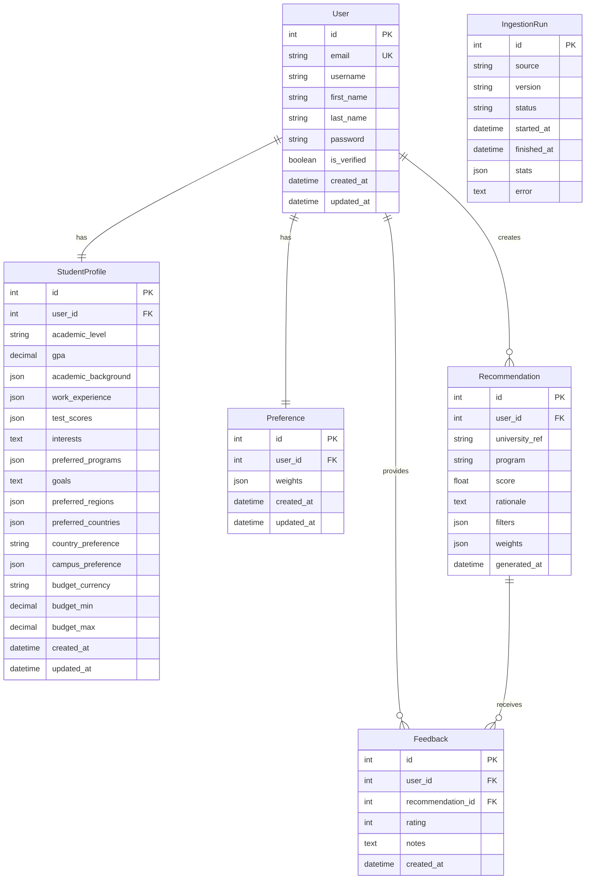

# UniQuest - Database Schema Diagram

This diagram shows the complete database schema with all tables, fields, and relationships.



## Table Descriptions

### users
**Primary Key:** `id`  
**Unique Constraints:** `email`

Stores user authentication and basic profile information.

| Column | Type | Constraints | Description |
|--------|------|-------------|-------------|
| id | INTEGER | PRIMARY KEY, AUTO_INCREMENT | Unique user identifier |
| email | VARCHAR(254) | UNIQUE, NOT NULL | User email address |
| username | VARCHAR(150) | UNIQUE | Username |
| first_name | VARCHAR(30) | | User's first name |
| last_name | VARCHAR(30) | | User's last name |
| password | VARCHAR(128) | | Hashed password |
| is_verified | BOOLEAN | DEFAULT FALSE | Email verification status |
| created_at | DATETIME | | Account creation timestamp |
| updated_at | DATETIME | | Last update timestamp |

**Indexes:**
- `idx_users_email` on `email`
- `idx_users_created_at` on `created_at`

---

### student_profiles
**Primary Key:** `id`  
**Foreign Keys:** `user_id` → `users.id` (ON DELETE CASCADE)  
**Unique Constraints:** `user_id` (one-to-one relationship)

Stores detailed academic and preference information for students.

| Column | Type | Constraints | Description |
|--------|------|-------------|-------------|
| id | INTEGER | PRIMARY KEY, AUTO_INCREMENT | Unique profile identifier |
| user_id | INTEGER | FOREIGN KEY, UNIQUE, NOT NULL | Reference to users table |
| academic_level | VARCHAR(20) | | Current/target level: high-school, bachelors, masters, phd, other |
| gpa | DECIMAL(3,2) | CHECK (0.0 <= gpa <= 4.0) | GPA on 4.0 scale |
| academic_background | JSON | DEFAULT '[]' | Array of academic history entries |
| work_experience | JSON | DEFAULT '[]' | Array of work experience entries |
| test_scores | JSON | DEFAULT '[]' | Array of test scores with examName, score, testDate |
| interests | TEXT | | Academic and career interests (free text) |
| preferred_programs | JSON | DEFAULT '[]' | Array of preferred programs/fields |
| goals | TEXT | | Educational and career goals (free text) |
| preferred_regions | JSON | DEFAULT '[]' | Array of ISO country codes |
| preferred_countries | JSON | DEFAULT '[]' | Array of preferred countries |
| country_preference | VARCHAR(2) | | ISO 2-letter primary country code |
| campus_preference | JSON | DEFAULT '[]' | Array: Urban, Suburban, Rural, Any |
| budget_currency | VARCHAR(3) | DEFAULT 'USD' | ISO 3-letter currency code |
| budget_min | DECIMAL(10,2) | | Minimum budget |
| budget_max | DECIMAL(10,2) | | Maximum budget (maxTuition) |
| created_at | DATETIME | | Profile creation timestamp |
| updated_at | DATETIME | | Last update timestamp |

**JSON Field Structures:**

**academic_background (stored as snake_case, API uses camelCase):**
```json
[
  {
    "id": "101",
    "level": "high-school",
    "course": "Science Stream",
    "institution": "Dublin High School",
    "yearOfCompletion": "2024",
    "gpa": 3.8
  }
]
```

**test_scores (stored as snake_case, API uses camelCase):**
```json
[
  {
    "examName": "IELTS",
    "score": 7.5,
    "testDate": "2024-06"
  }
]
```

**Note:** The database stores JSON fields in snake_case format (e.g., `year_of_completion`, `exam_name`), but the API automatically converts to camelCase (e.g., `yearOfCompletion`, `examName`) using `djangorestframework-camel-case`.

**Indexes:**
- `idx_student_profiles_user` on `user_id`
- `idx_student_profiles_country` on `country_preference`
- `idx_student_profiles_created` on `created_at`

---

### preferences
**Primary Key:** `id`  
**Foreign Keys:** `user_id` → `users.id` (ON DELETE CASCADE)  
**Unique Constraints:** `user_id` (one-to-one relationship)

Stores user preference weights for recommendation algorithm.

| Column | Type | Constraints | Description |
|--------|------|-------------|-------------|
| id | INTEGER | PRIMARY KEY, AUTO_INCREMENT | Unique preference identifier |
| user_id | INTEGER | FOREIGN KEY, UNIQUE, NOT NULL | Reference to users table |
| weights | JSON | DEFAULT '{}' | Recommendation factor weights |
| created_at | DATETIME | | Preference creation timestamp |
| updated_at | DATETIME | | Last update timestamp |

**weights JSON Structure:**
```json
{
  "academics": 0.30,
  "interests": 0.20,
  "career": 0.20,
  "location": 0.10,
  "budget": 0.10,
  "ranking": 0.05,
  "research_activity": 0.05
}
```

**Indexes:**
- `idx_preferences_user` on `user_id`
- `idx_preferences_updated` on `updated_at`

---

### recommendations
**Primary Key:** `id`  
**Foreign Keys:** `user_id` → `users.id` (ON DELETE CASCADE)

Stores generated university recommendations with LLM-powered scores and rationales.

| Column | Type | Constraints | Description |
|--------|------|-------------|-------------|
| id | INTEGER | PRIMARY KEY, AUTO_INCREMENT | Unique recommendation identifier |
| user_id | INTEGER | FOREIGN KEY, NOT NULL | Reference to users table |
| university_ref | VARCHAR(255) | | OpenAlex institution ID |
| program | VARCHAR(255) | | Program name (optional) |
| score | FLOAT | CHECK (0.0 <= score <= 1.0) | Match score (0.0-1.0) |
| rationale | TEXT | | LLM-generated explanation |
| filters | JSON | | Filters used for generation |
| weights | JSON | | Weights used for generation |
| generated_at | DATETIME | | Generation timestamp |

**Indexes:**
- `idx_recommendations_user` on `user_id`
- `idx_recommendations_university` on `university_ref`
- `idx_recommendations_generated` on `generated_at`

---

### feedback
**Primary Key:** `id`  
**Foreign Keys:** 
- `user_id` → `users.id` (ON DELETE CASCADE)
- `recommendation_id` → `recommendations.id` (ON DELETE CASCADE)
**Unique Constraints:** `(user_id, recommendation_id)` (one feedback per user per recommendation)

Stores user feedback on recommendations.

| Column | Type | Constraints | Description |
|--------|------|-------------|-------------|
| id | INTEGER | PRIMARY KEY, AUTO_INCREMENT | Unique feedback identifier |
| user_id | INTEGER | FOREIGN KEY, NOT NULL | Reference to users table |
| recommendation_id | INTEGER | FOREIGN KEY, NOT NULL | Reference to recommendations table |
| rating | INTEGER | CHECK (1 <= rating <= 5) | Star rating (1-5) |
| notes | TEXT | | Optional feedback notes |
| created_at | DATETIME | | Feedback creation timestamp |

**Indexes:**
- `idx_feedback_user` on `user_id`
- `idx_feedback_recommendation` on `recommendation_id`
- `idx_feedback_user_recommendation` on `(user_id, recommendation_id)` UNIQUE

---

### ingestion_runs
**Primary Key:** `id`

Tracks dataset ingestion history and statistics.

| Column | Type | Constraints | Description |
|--------|------|-------------|-------------|
| id | INTEGER | PRIMARY KEY, AUTO_INCREMENT | Unique run identifier |
| source | VARCHAR(255) | | Data source (e.g., "openalex") |
| version | VARCHAR(50) | | Dataset version |
| status | VARCHAR(20) | | PENDING, RUNNING, SUCCESS, FAILED, CANCELLED |
| started_at | DATETIME | | Ingestion start time |
| finished_at | DATETIME | | Ingestion completion time |
| stats | JSON | | Statistics (total_records, countries, etc.) |
| error | TEXT | | Error message if failed |

**Indexes:**
- `idx_ingestion_runs_status` on `status`
- `idx_ingestion_runs_started` on `started_at`

---

## Relationships

### One-to-One Relationships
- **User ↔ StudentProfile**: Each user has exactly one student profile
- **User ↔ Preference**: Each user has exactly one preference setting

### One-to-Many Relationships
- **User → Recommendations**: A user can have multiple recommendations
- **User → Feedback**: A user can provide multiple feedback entries
- **Recommendation → Feedback**: A recommendation can receive multiple feedback entries

### Constraints
- **Cascade Deletes**: When a user is deleted, their profile, preferences, recommendations, and feedback are automatically deleted
- **Unique Constraints**: 
  - One profile per user
  - One preference per user
  - One feedback per user per recommendation

---

## Data Types Summary

| Type | Usage | Examples |
|------|-------|----------|
| INTEGER | IDs, foreign keys | `id`, `user_id` |
| VARCHAR(n) | Short strings | `email`, `username`, `country_preference` |
| TEXT | Long strings | `interests`, `goals`, `rationale`, `notes` |
| DECIMAL(m,n) | Precise numbers | `gpa`, `budget_min`, `budget_max` |
| FLOAT | Approximate numbers | `score` |
| BOOLEAN | True/false | `is_verified` |
| JSON | Structured data | `test_scores`, `academic_background`, `weights` |
| DATETIME | Timestamps | `created_at`, `updated_at`, `generated_at` |

---

## Indexes Summary

| Table | Index Name | Columns | Type |
|-------|------------|---------|------|
| users | idx_users_email | email | UNIQUE |
| users | idx_users_created | created_at | |
| student_profiles | idx_student_profiles_user | user_id | UNIQUE |
| student_profiles | idx_student_profiles_country | country_preference | |
| student_profiles | idx_student_profiles_created | created_at | |
| preferences | idx_preferences_user | user_id | UNIQUE |
| preferences | idx_preferences_updated | updated_at | |
| recommendations | idx_recommendations_user | user_id | |
| recommendations | idx_recommendations_university | university_ref | |
| recommendations | idx_recommendations_generated | generated_at | |
| feedback | idx_feedback_user | user_id | |
| feedback | idx_feedback_recommendation | recommendation_id | |
| feedback | idx_feedback_user_recommendation | (user_id, recommendation_id) | UNIQUE |
| ingestion_runs | idx_ingestion_runs_status | status | |
| ingestion_runs | idx_ingestion_runs_started | started_at | |

---

## Migration Notes

### Migration 0003: Extended Profile Fields
Added the following fields to `student_profiles`:
- `academic_level` (VARCHAR)
- `academic_background` (JSON, array)
- `work_experience` (JSON, array)
- `preferred_programs` (JSON, array)
- `preferred_countries` (JSON, array)
- `campus_preference` (JSON, array)
- `budget_currency` (VARCHAR, default 'USD')

Changed:
- `test_scores` from JSON object to JSON array format

---

**Last Updated:** October 28, 2025  
**Database:** SQLite (development), PostgreSQL (production)  
**ORM:** Django 5.2.6

