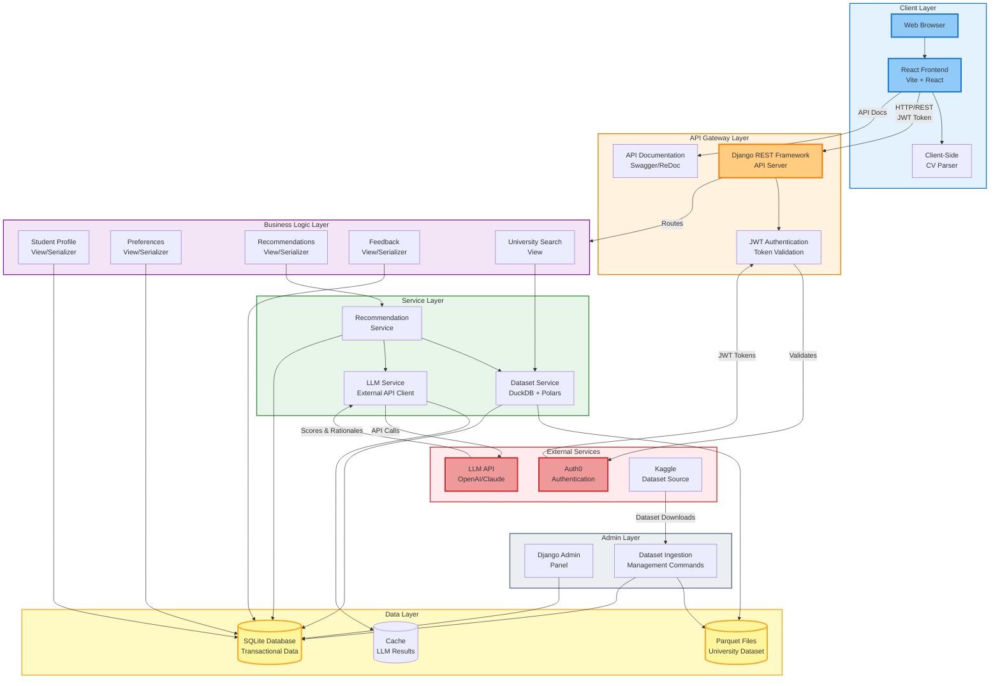

# UniQuest - High-Level Design (System Design)

This diagram shows the overall system architecture, components, and data flow in an Excalidraw-style visualization.



## System Architecture Overview

### 1. Client Layer
**Components:**
- **Web Browser**: User interface rendering
- **React Frontend**: Single-page application built with Vite
- **Client-Side CV Parser**: PDF parsing in browser (privacy-first, no server upload)

**Responsibilities:**
- User interface rendering
- Client-side data processing
- API communication
- JWT token management
- State management

### 2. API Gateway Layer
**Components:**
- **Django REST Framework**: Main API server handling HTTP requests
- **JWT Authentication**: Token validation and user authentication
- **API Documentation**: Swagger UI and ReDoc for API exploration

**Responsibilities:**
- Request routing
- Authentication/authorization
- Request/response serialization
- API documentation
- Error handling

### 3. Business Logic Layer
**Components:**
- **Student Profile View**: CRUD operations for student profiles
- **Preferences View**: User preference weight management
- **Recommendations View**: Recommendation generation and retrieval
- **Feedback View**: User feedback collection
- **Dataset View**: University search and details

**Responsibilities:**
- Request validation
- Business rule enforcement
- Data transformation (camelCase ↔ snake_case)
- Service orchestration

### 4. Service Layer
**Components:**
- **Recommendation Service**: Orchestrates recommendation generation
- **Dataset Service**: Manages file-backed university dataset queries
- **LLM Service**: Interfaces with external LLM APIs

**Responsibilities:**
- Complex business logic
- Data aggregation
- External API integration
- Caching strategies
- Performance optimization

### 5. Data Layer
**Components:**
- **SQLite Database**: Transactional data (users, profiles, recommendations, feedback)
- **Parquet Files**: Read-only university dataset (millions of records)
- **Cache**: LLM response caching (Redis/memory)

**Responsibilities:**
- Data persistence
- Fast query execution
- Data integrity
- Performance optimization

### 6. External Services
**Components:**
- **Auth0**: Authentication and authorization service
- **LLM API**: External AI service (OpenAI/Claude) for scoring and rationale generation
- **Kaggle**: Dataset source for university data

**Responsibilities:**
- User authentication
- AI-powered recommendations
- Dataset provisioning

### 7. Admin Layer
**Components:**
- **Django Admin Panel**: Web-based administration interface
- **Dataset Ingestion Commands**: Management commands for dataset processing

**Responsibilities:**
- System administration
- Dataset management
- User management
- System monitoring

## Data Flow

### 1. User Registration/Login Flow
```
Browser → React → Django API → JWT → Auth0
Auth0 → JWT Token → React → Local Storage
```

### 2. Profile Creation Flow
```
React → Django API → Student View → SQLite
SQLite → Student View → Django API → React (camelCase JSON)
```

### 3. Recommendation Generation Flow
```
React → Django API → Recommendation View → Recommendation Service
Recommendation Service → Dataset Service → Parquet Files (DuckDB)
Recommendation Service → LLM Service → LLM API (with Cache)
LLM Service → Recommendation Service → SQLite
Recommendation Service → Recommendation View → Django API → React
```

### 4. University Search Flow
```
React → Django API → Dataset View → Dataset Service
Dataset Service → Parquet Files (DuckDB Query)
Dataset Service → Dataset View → Django API → React
```

### 5. Dataset Ingestion Flow
```
Admin → Ingestion Commands → Kaggle API
Kaggle → Raw Data → Ingestion Commands → Parquet Files
Ingestion Commands → SQLite (IngestionRun tracking)
```

## Technology Stack

### Frontend
- **React**: UI framework
- **Vite**: Build tool and dev server
- **Client-Side PDF Parser**: Browser-based CV parsing

### Backend
- **Django 5**: Web framework
- **Django REST Framework**: API toolkit
- **djangorestframework-simplejwt**: JWT authentication
- **djangorestframework-camel-case**: JSON naming conversion
- **drf-spectacular**: OpenAPI schema generation

### Data Processing
- **DuckDB**: In-memory analytical database
- **Polars**: Fast DataFrame library
- **Parquet**: Columnar storage format

### External Integrations
- **Auth0**: Authentication service
- **LLM API**: External AI service (OpenAI/Claude)
- **Kaggle API**: Dataset downloads

### Database
- **SQLite**: Transactional database
- **Parquet Files**: Analytical dataset storage

## Key Design Patterns

### 1. Layered Architecture
- Clear separation of concerns
- Each layer has specific responsibilities
- Easy to test and maintain

### 2. Service Layer Pattern
- Business logic separated from views
- Reusable service components
- Easier to test and mock

### 3. Hybrid Storage Pattern
- SQLite for transactional data (ACID compliance)
- Parquet for analytical data (read-heavy, fast queries)
- Best of both worlds

### 4. Caching Strategy
- LLM responses cached to reduce API costs
- Cache key based on input hash
- TTL-based expiration

### 5. API-First Design
- RESTful API design
- OpenAPI documentation
- camelCase JSON for frontend compatibility

## Security Considerations

### Authentication
- JWT tokens via Auth0
- Token validation on every request
- Token refresh mechanism

### Authorization
- Permission classes (IsAuthenticated, AllowAny)
- User-specific data access
- Admin-only endpoints

### Data Privacy
- Client-side CV parsing (no server upload)
- User data isolation
- GDPR compliance (data deletion)

## Scalability Considerations

### Current Architecture
- Single Django server
- SQLite database (suitable for small-medium scale)
- File-backed dataset (no database overhead)

### Future Scalability Options
- **Horizontal Scaling**: Multiple Django instances behind load balancer
- **Database Migration**: PostgreSQL for production
- **Caching Layer**: Redis for distributed caching
- **CDN**: Static file serving
- **Message Queue**: Async task processing (Celery)

## Performance Optimizations

### Dataset Queries
- DuckDB for fast analytical queries
- Parquet columnar storage
- In-memory query execution

### LLM Integration
- Response caching (1 hour TTL)
- Batch processing where possible
- Fallback mechanisms

### API Response
- Efficient serialization
- Pagination for large datasets
- Selective field loading

## Monitoring & Observability

### Health Checks
- `/api/healthz/` endpoint
- Database connectivity check
- Dataset availability check

### Logging
- Django logging framework
- Structured logging
- Error tracking

### Admin Tools
- Django admin panel
- Ingestion run tracking
- Dataset validation

## Deployment Architecture

### Development
- Single Django development server
- SQLite database
- Local Parquet files

### Production (Recommended)
- **Web Server**: Gunicorn + Nginx
- **Database**: SQLite (or PostgreSQL for scale)
- **Static Files**: Nginx or CDN
- **Dataset Storage**: File system or object storage (S3)
- **Containerization**: Docker + Docker Compose

## Component Interactions

### Request Flow Example: Generate Recommendations

1. **Client Request**: React sends POST to `/api/recommendations/run/` with JWT token
2. **Authentication**: Django validates JWT token via Auth0
3. **Authorization**: Check if user is authenticated
4. **Business Logic**: Recommendation View validates request
5. **Service Orchestration**: Recommendation Service coordinates:
   - Fetch user profile from SQLite
   - Query matching universities from Parquet via Dataset Service
   - Score each university via LLM Service (with caching)
   - Apply user preference weights
   - Generate rationales via LLM Service
6. **Data Persistence**: Save recommendations to SQLite
7. **Response**: Serialize to camelCase JSON and return to client

### Data Storage Strategy

**SQLite (Transactional)**
- User accounts
- Student profiles
- Preferences
- Recommendations (generated)
- Feedback
- Ingestion runs

**Parquet Files (Analytical)**
- University dataset (millions of records)
- Search indexes
- Read-only access
- Fast analytical queries

## API Design Principles

### RESTful Design
- Resource-based URLs
- HTTP methods (GET, POST, PATCH, PUT, DELETE)
- Status codes (200, 201, 400, 401, 404, 500)

### JSON Format
- camelCase for frontend compatibility
- Automatic conversion from snake_case (backend)
- Consistent structure across endpoints

### Error Handling
- Standardized error responses
- Detailed error messages
- Appropriate HTTP status codes

## Future Enhancements

### Planned Features
- Real-time notifications
- WebSocket support
- Advanced filtering
- Recommendation history comparison
- Export to PDF/CSV
- Social sharing

### Infrastructure Improvements
- Microservices architecture (if needed)
- Event-driven architecture
- GraphQL API option
- Advanced caching strategies
- Database replication

