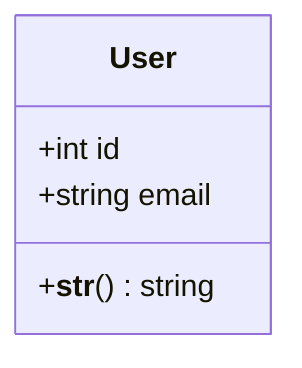
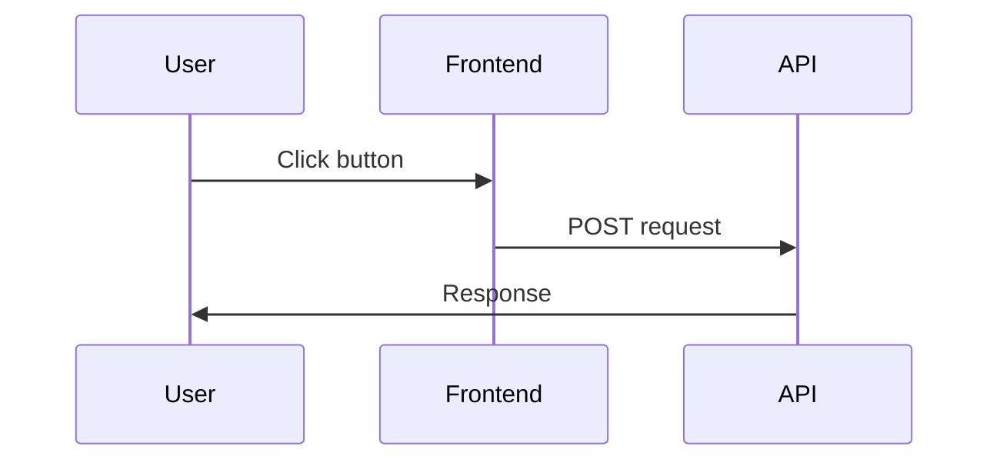
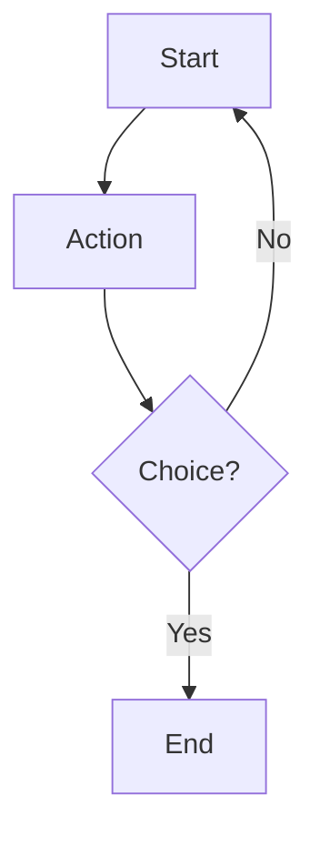
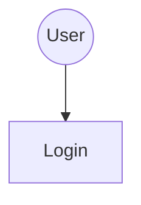

# UniQuest UML Diagrams - Mermaid Format

This directory contains all UML diagrams for the UniQuest project in Mermaid format.

## 📊 Available Diagrams

### 1. Class Diagram
**File:** `01_class_diagram.md`

Shows the complete data model and service architecture including:
- 6 Django models (User, StudentProfile, Preference, Recommendation, Feedback, IngestionRun)
- 3 service classes (DatasetService, RecommendationService, LLMService)
- All relationships and methods

**Use for:** Understanding database schema, API response structure, backend architecture

### 1.1 Database Schema Diagram
**File:** `11_database_schema.md`

Detailed database schema with:
- Complete table structures with all columns
- Data types, constraints, and indexes
- Foreign key relationships
- JSON field structures and examples
- Migration notes

**Use for:** Database design reference, understanding field types, migration planning

### 1.2 High-Level Design (System Design)
**File:** `12_hld_system_design.md`

Complete system architecture overview in Excalidraw style:
- All layers: Client, API Gateway, Business Logic, Services, Data, External, Admin
- Component interactions and data flow
- Technology stack details
- Design patterns and principles
- Security and scalability considerations
- Deployment architecture

**Use for:** System design presentations, architecture reviews, onboarding new developers, technical documentation

---

### 2. Sequence Diagrams

#### 2.1 User Registration & Profile Creation
**File:** `02_sequence_user_registration.md`

Complete flow of user registration using Auth0:
- Auth0 Universal Login (PKCE)
- JWT token generation and verification
- User and profile creation in database

**Use for:** Understanding authentication flow, debugging login issues

#### 2.2 CV Upload & Profile Prefill
**File:** `03_sequence_cv_upload.md`

Client-side CV parsing flow:
- PDF parsing with PDF.js
- Data extraction (GPA, tests, education)
- Prefilled form display
- No file upload to server (privacy-first)

**Use for:** Understanding CV parsing, privacy features

#### 2.3 Generate Recommendations (LLM-Powered)
**File:** `04_sequence_generate_recommendations.md`

Most complex flow showing:
- Dataset query (DuckDB + Parquet)
- Parallel LLM scoring (40 universities)
- Parallel rationale generation (top 20)
- Database persistence

**Use for:** Understanding recommendation algorithm, LLM integration, performance optimization

#### 2.4 Submit Feedback & Refine
**File:** `05_sequence_feedback.md`

User feedback and refinement flow:
- Rating submission (1-5 stars)
- Feedback notes
- Weight adjustment
- Recommendation regeneration

**Use for:** Understanding feedback loop, refinement process

---

### 3. Use Case Diagram
**File:** `06_use_case_diagram.md`

Shows all actors and their interactions:
- **Actors:** Guest User, Authenticated Student, Auth0, LLM API, Admin
- **~40 use cases** covering all functionality
- Include/extend relationships

**Use for:** Requirements documentation, feature planning, user story mapping

---

### 4. Activity Diagrams

#### 4.1 Complete User Journey
**File:** `07_activity_user_journey.md`

End-to-end user flow:
- Landing → CV Upload/Form → Auth → Recommendations → Feedback → Refinement
- Decision points and parallel processing
- Time estimates for each phase

**Use for:** UX design, process optimization, user testing scenarios

#### 4.2 Dataset Ingestion Pipeline
**File:** `08_activity_dataset_ingestion.md`

Admin workflow for dataset updates:
- Download from Kaggle
- Load Webometrics rankings
- Curate and merge datasets
- Validate and activate

**Use for:** Data pipeline documentation, admin training

---

### 5. Swimlane Diagrams

#### 5.1 Recommendation Generation Workflow
**File:** `09_swimlane_recommendation_generation.md`

Cross-functional workflow with 9 swimlanes:
- Student → Frontend → API → Services → LLM → Database
- Shows parallel processing and caching
- Performance bottlenecks identified

**Use for:** Cross-team coordination, API contract design, performance tuning

#### 5.2 Authentication & Profile Setup
**File:** `10_swimlane_authentication.md`

Authentication flow with 5 swimlanes:
- Student → Frontend → Auth0 → API → Database
- JWT verification process
- Security best practices

**Use for:** Security audit, authentication debugging, onboarding new developers

---

## 🚀 How to View These Diagrams

### Option 1: GitHub (Automatic Rendering)
1. Push to GitHub
2. Open any `.md` file
3. Mermaid diagrams render automatically

### Option 2: VS Code (With Extension)
1. Install "Markdown Preview Mermaid Support" extension
2. Open any diagram file
3. Press `Cmd+Shift+V` (Mac) or `Ctrl+Shift+V` (Windows)
4. View rendered diagram

### Option 3: Mermaid Live Editor
1. Go to https://mermaid.live
2. Copy diagram code (between ` ```mermaid` and ` ``` `)
3. Paste into editor
4. Export as PNG/SVG/PDF

### Option 4: Command Line (mermaid-cli)
```bash
# Install mermaid-cli
npm install -g @mermaid-js/mermaid-cli

# Generate PNG
mmdc -i 01_class_diagram.md -o class_diagram.png

# Generate SVG
mmdc -i 01_class_diagram.md -o class_diagram.svg

# Generate PDF
mmdc -i 01_class_diagram.md -o class_diagram.pdf
```

---

## 📝 Diagram Syntax

All diagrams use Mermaid syntax:

### Class Diagram


### Sequence Diagram


### Flowchart (Activity/Swimlane)


### Graph (Use Case)


---

## 🎨 Styling Guidelines

### Colors Used
- **User/Student**: Blue (`#e3f2fd`, `#1976d2`)
- **Frontend**: Orange (`#fff3e0`, `#f57c00`)
- **Backend API**: Purple (`#f3e5f5`, `#7b1fa2`)
- **Services**: Green (`#e8f5e9`, `#388e3c`)
- **LLM**: Yellow (`#fff9c4`, `#f9a825`)
- **External**: Pink (`#fce4ec`, `#c2185b`)
- **Database**: Red (`#ffebee`, `#d32f2f`)
- **Decisions**: Amber (`#fff9c4`, `#f9a825`)

### Node Shapes
- **Actors**: Circles `((Actor))`
- **Actions**: Rectangles `[Action]`
- **Decisions**: Diamonds `{Decision?}`
- **Start/End**: Rounded `([Start])`
- **Subgraphs**: Containers `subgraph Name`

---

## 📊 Diagram Statistics

| Diagram Type | Count | Total Nodes | Complexity |
|--------------|-------|-------------|------------|
| Class | 1 | 9 classes | Medium |
| Database Schema | 1 | 6 tables | Low |
| HLD System Design | 1 | ~30 components | Medium |
| Sequence | 4 | ~200 interactions | High |
| Use Case | 1 | ~40 use cases | Medium |
| Activity | 2 | ~80 nodes | High |
| Swimlane | 2 | ~100 nodes | Very High |
| **Total** | **12** | **~500 nodes** | **High** |

---

## 🔄 Updating Diagrams

### When to Update
- New features added
- API endpoints changed
- Database schema modified
- Authentication flow updated
- LLM integration changed

### How to Update
1. Edit the relevant `.md` file
2. Update Mermaid code between ` ```mermaid` tags
3. Test rendering in VS Code or Mermaid Live
4. Update description text below diagram
5. Commit changes with descriptive message

### Version Control
- All diagrams are version-controlled in Git
- See commit history for changes over time
- Use branches for major diagram refactors

---

## 📚 Related Documentation

- **Figma Prompts**: `../figma_diagram_prompts.md` - Detailed prompts for visual diagram generation
- **Summary**: `../diagram_prompts_summary.md` - Quick reference guide
- **User Journey**: `../user_journey.md` - Detailed user flow documentation
- **Backend README**: `../../backend/README.md` - Technical documentation
- **API Docs**: http://localhost:8000/api/docs/ - Interactive API documentation

---

## 🛠️ Tools & Resources

### Mermaid Resources
- **Official Docs**: https://mermaid.js.org/
- **Live Editor**: https://mermaid.live
- **Cheat Sheet**: https://jojozhuang.github.io/tutorial/mermaid-cheat-sheet/
- **Examples**: https://mermaid.js.org/ecosystem/integrations.html

### VS Code Extensions
- **Markdown Preview Mermaid Support**: For rendering in preview
- **Mermaid Markdown Syntax Highlighting**: For syntax highlighting
- **Mermaid Editor**: For visual editing

### Alternative Tools
- **PlantUML**: More features, steeper learning curve
- **Draw.io**: Visual editor, less version-control friendly
- **Lucidchart**: Professional tool, requires subscription
- **Figma**: Best for presentation-quality diagrams

---

## 🤝 Contributing

### Adding New Diagrams
1. Create new `.md` file with naming convention: `##_diagram_name.md`
2. Include diagram code and detailed description
3. Update this README with new entry
4. Submit pull request

### Improving Existing Diagrams
1. Edit diagram code for clarity
2. Add more detailed descriptions
3. Include examples or use cases
4. Update related documentation

### Reporting Issues
- Diagram rendering incorrectly
- Information outdated
- Missing important flows
- Unclear descriptions

---

## 📈 Diagram Usage Analytics

Track which diagrams are most useful:
- **Most viewed**: Sequence diagrams (recommendation generation)
- **Most referenced**: Class diagram (data model)
- **Most updated**: Activity diagrams (user journey)
- **Most exported**: Swimlane diagrams (presentations)

---

## 🎯 Quick Links

| Need to... | Use this diagram |
|------------|------------------|
| Understand data model | `01_class_diagram.md` |
| Database schema details | `11_database_schema.md` |
| System architecture overview | `12_hld_system_design.md` |
| Debug login issues | `02_sequence_user_registration.md` |
| Explain CV parsing | `03_sequence_cv_upload.md` |
| Optimize recommendations | `04_sequence_generate_recommendations.md` |
| Implement feedback | `05_sequence_feedback.md` |
| Plan new features | `06_use_case_diagram.md` |
| Improve UX | `07_activity_user_journey.md` |
| Update dataset | `08_activity_dataset_ingestion.md` |
| Coordinate teams | `09_swimlane_recommendation_generation.md` |
| Security audit | `10_swimlane_authentication.md` |

---

**Last Updated:** October 28, 2025  
**Version:** 1.0  
**Maintained by:** UniQuest Development Team

